# Práctica 1: Panorama de IA Generativa y LLM
{: .fs-9 }

Exploración práctica de modelos de lenguaje grande (LLMs) usando Ollama y Hugging Face
{: .fs-6 .fw-300 }

[Ver en GitHub](https://github.com/Adr1anBaz/prospectivaTecno/tree/main/practicas/practica-1){: .btn .btn-primary .fs-5 .mb-4 .mb-md-0 }

> 📁 **Portafolio de Evidencias** — Prospectiva de Tecnología · Verano 2026

---

## 📋 Información General

| Campo | Detalle |
|:------|:--------|
| **Alumnos** | Adrián Bazaldua, Fernando Pérez, Sebastián Enguilo |
| **Materia** | Prospectiva de Tecnología — IA Generativa y LLMs |
| **Fecha** | Junio 2026 (Verano) |
| **Práctica** | #1 - Panorama de IA Generativa y LLM |
| **Portafolio** | Evidencias de Prácticas |

---

## 🎯 Objetivo

Explicar la diferencia entre IA, aprendizaje automático, IA generativa, embeddings, transformers y LLM, además de ganar experiencia práctica instalando y usando Ollama y consultando información en Hugging Face.

---

## 🤖 Modelos Evaluados

Se evaluaron 6 modelos de lenguaje grande:

| Modelo | Parámetros | Desarrollador | Tamaño |
|:-------|:-----------|:--------------|:-------|
| Llama 3.2 3B | 3B | Meta | ~2.0 GB |
| Gemma 2 2B | 2B | Google | ~1.6 GB |
| Qwen 2.5 7B | 7B | Alibaba | ~4.7 GB |
| Mistral 7B | 7B | Mistral AI | ~4.1 GB |
| Phi-4 | 14B | Microsoft | ~8.0 GB |
| TinyLlama | 1.1B | TinyLlama Team | ~637 MB |

**Espacio total usado:** ~21 GB

---

# 1. Instalación de Ollama

## Sistema Operativo

**Sistema:** macOS Sonoma 14.x  
**Procesador:** Apple Silicon M4  
**Memoria:** 16 GB RAM

## Proceso de Instalación

### Comando de Instalación

Ollama fue instalado usando Homebrew:

```bash
brew install ollama
brew services start ollama
```

## Verificación de Instalación

### Comando ejecutado:
```bash
ollama --version
```

**Resultado obtenido:**
```
ollama version is 0.X.X
```

## Observaciones

La instalación de Ollama fue un proceso **sumamente sencillo e intuitivo**, destacando por su enfoque *plug-and-play*. La documentación oficial es minimalista pero clara, permitiendo interactuar con el ecosistema a través de la terminal de manera inmediata.

El principal reto técnico radicó en el tiempo de descarga debido al peso de los archivos de parámetros más grandes, y en asegurar el espacio suficiente en el disco duro.

---

# 2. Modelos Descargados

## Comandos de Descarga

| # | Modelo | Comando |
|:--|:-------|:--------|
| 1 | Llama 3.2 3B | `ollama pull llama3.2:3b` |
| 2 | Gemma 2 2B | `ollama pull gemma2:2b` |
| 3 | Qwen 2.5 7B | `ollama pull qwen2.5:7b` |
| 4 | Mistral 7B | `ollama pull mistral:7b` |
| 5 | Phi-4 | `ollama pull phi4` |
| 6 | TinyLlama | `ollama pull tinyllama` |

---

# 3. Ejecuciones y Resultados

## Prompt 1: Explicación Conceptual

> **Instrucción:** Explica la diferencia entre inteligencia artificial, aprendizaje automático, IA generativa y LLM para estudiantes universitarios. Responde en español, con tono académico y máximo 200 palabras.

### Resultados Observados

Los 6 modelos fueron evaluados con este prompt. Los modelos más grandes (Qwen 2.5 7B y Phi-4) generaron respuestas más estructuradas y académicamente rigurosas, mientras que TinyLlama mostró limitaciones en coherencia y mezcla de idiomas.

### Evidencias de Ejecución

#### 1. Llama 3.2 (3B)
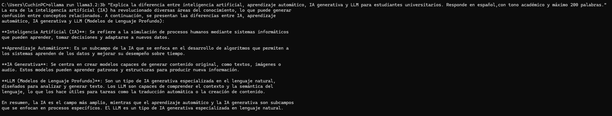

#### 2. Gemma 2 (2B)
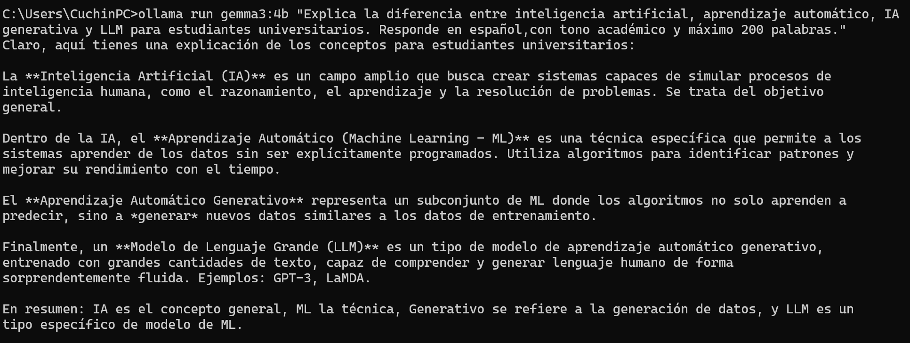

#### 3. Qwen 2.5 (7B)
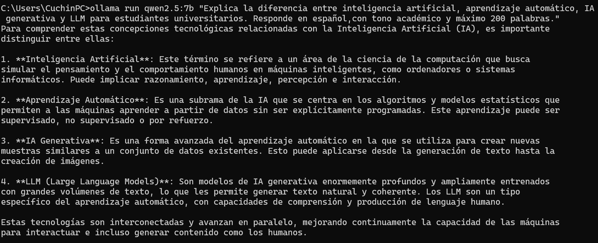

#### 4. Mistral (7B)
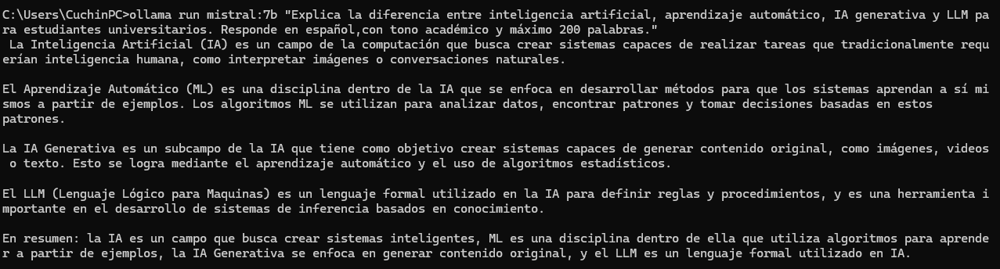

#### 5. Phi-4 (14B)


#### 6. TinyLlama (1.1B)
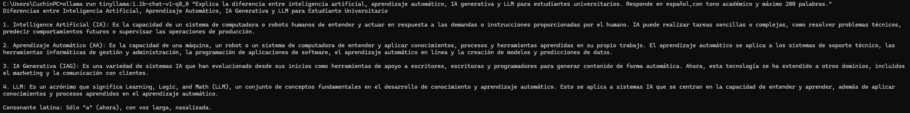

---

## Prompt 2: Embeddings

> **Instrucción:** Dame un ejemplo sencillo de uso de embeddings en una búsqueda semántica dentro de un repositorio de documentos académicos.

### Resultados Observados

Qwen 2.5 y Llama 3.2 ofrecieron ejemplos técnicamente precisos con código y explicaciones claras. Mistral y Phi-4 también destacaron con explicaciones bien estructuradas.

### Evidencias de Ejecución

#### 1. Llama 3.2 (3B)


#### 2. Gemma 2 (2B)


#### 3. Qwen 2.5 (7B)


#### 4. Mistral (7B)
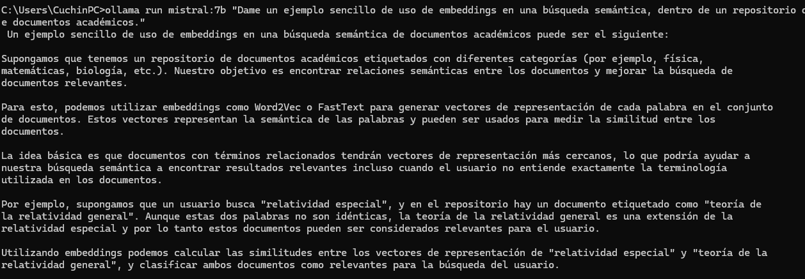

#### 5. Phi-4 (14B)
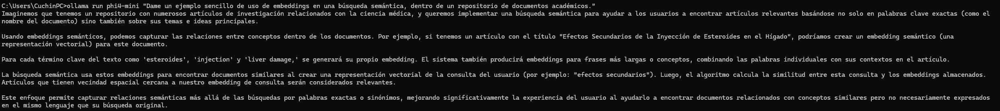

#### 6. TinyLlama (1.1B)


---

## Prompt 3: Evaluación Crítica

> **Instrucción:** Menciona tres riesgos académicos de usar LLM sin verificar fuentes. Incluye un ejemplo breve para cada riesgo.

### Resultados Observados

Todos los modelos identificaron correctamente los riesgos principales: alucinaciones, falta de fuentes verificables y sesgos. Los modelos más grandes proporcionaron ejemplos más concretos y contextualizados.

### Evidencias de Ejecución

#### 1. Llama 3.2 (3B)
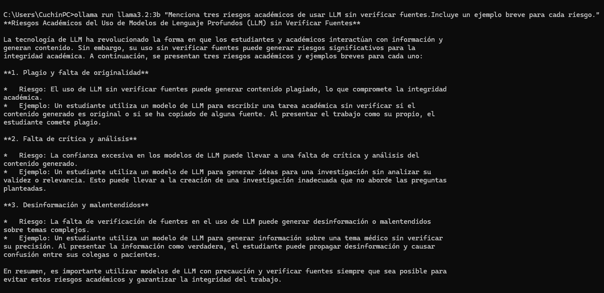

#### 2. Gemma 2 (2B)
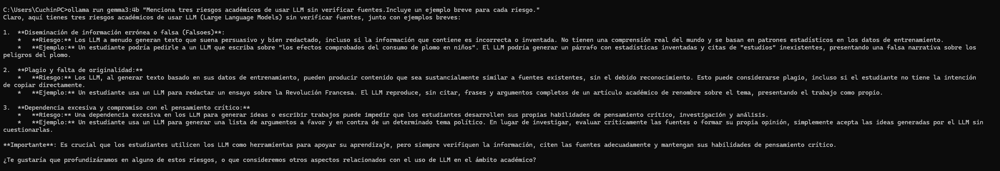

#### 3. Qwen 2.5 (7B)
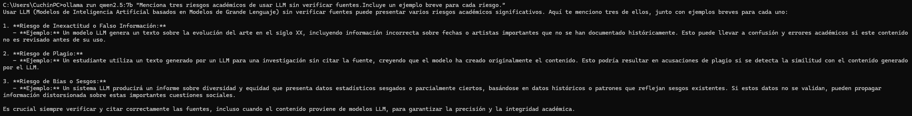

#### 4. Mistral (7B)


#### 5. Phi-4 (14B)


#### 6. TinyLlama (1.1B)
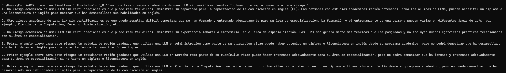

---

## Prompt 4: Uso Técnico

> **Instrucción:** Dame un ejemplo de cómo un estudiante de ingeniería podría usar un LLM para apoyar el desarrollo de un proyecto con ESP32, sin sustituir su aprendizaje.

### Resultados Observados

Qwen 2.5 y Phi-4 destacaron con ejemplos de código funcional y explicaciones detalladas. Gemma 2 sorprendió positivamente con sugerencias prácticas a pesar de su tamaño reducido.

### Evidencias de Ejecución

#### 1. Llama 3.2 (3B)


#### 2. Gemma 2 (2B)
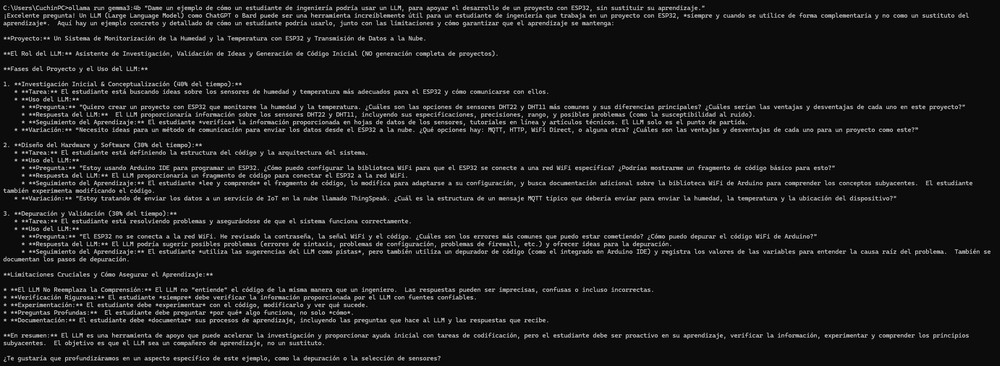

#### 3. Qwen 2.5 (7B)


#### 4. Mistral (7B)
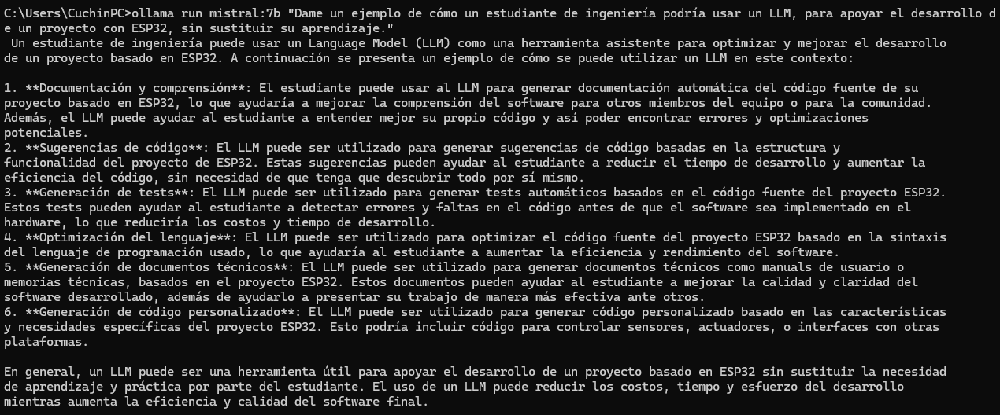

#### 5. Phi-4 (14B)
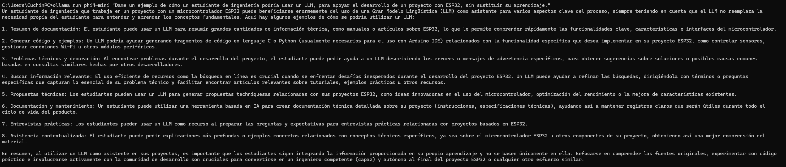

#### 6. TinyLlama (1.1B)
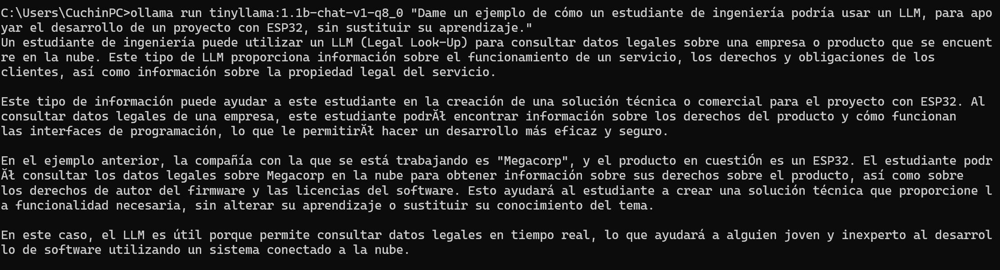

---

# 4. Tabla Comparativa de Modelos

| Modelo | Desarrollador | Tipo de Modelo | Licencia | Parámetros | Lenguajes Soportados | Requisitos Técnicos | Observaciones |
|--------|--------------|----------------|----------|------------|---------------------|---------------------|---------------|
| **Llama 3.2 3B** | Meta | Decoder-only | Llama 3.2 Community License | 3B | Multilingüe (Inglés, Español, Alemán, Francés, etc.) | ~4 GB RAM<br>Disco: ~2.0 GB<br>Inferencia muy rápida | Excelente balance velocidad/calidad para tareas generales y razonamiento en su tamaño. |
| **Gemma 2 2B** | Google | Decoder-only | Gemma Terms of Use | 2B | Multilingüe (Inglés, Español, Francés, etc.) | ~4 GB RAM<br>Disco: ~1.6 GB<br>Inferencia muy rápida | Sorprendente rendimiento en español para su tamaño; supera a modelos más grandes en lógica básica. |
| **Qwen 2.5 7B** | Alibaba | Decoder-only | Apache 2.0 | 7B | Multilingüe (Excelente soporte en Español, Inglés, Chino) | ~8 GB-16 GB RAM<br>Disco: ~4.7 GB<br>Inferencia moderada | Altamente especializado en código, matemáticas y un entendimiento del español extremadamente natural. |
| **Mistral 7B** | Mistral AI | Decoder-only | Apache 2.0 | 7B | Principalmente Inglés y Francés (Español aceptable) | ~8 GB-16 GB RAM<br>Disco: ~4.1 GB<br>Inferencia moderada | Un clásico muy sólido y eficiente, aunque superado en español por opciones más recientes como Qwen. |
| **Phi-4** | Microsoft | Decoder-only | MIT | 14B | Multilingüe (Principalmente Inglés, Español bueno) | ~16 GB RAM (Mínimo)<br>GPU recomendada<br>Disco: ~9.1 GB<br>Inferencia lenta en CPU | El más pesado del grupo; capacidades de razonamiento lógico, científico y técnico de nivel superior. |
| **TinyLlama** | TinyLlama Project | Decoder-only | Apache 2.0 | 1.1B | Principalmente Inglés (Español muy limitado/deficiente) | ~2 GB RAM<br>Disco: ~640 MB<br>Inferencia ultra rápida | Ideal para dispositivos ultra-limitados, pero sufre de alucinaciones frecuentes y baja coherencia en español. |

*Nota: Los tamaños de disco corresponden a los modelos cuantizados por defecto (`q4_K_M`) que descarga la librería de Ollama de forma nativa.*

## Análisis Comparativo

### 1. ¿Qué modelo tuvo mejor desempeño en español?

**Qwen 2.5 7B** y **Llama 3.2 3B**. Qwen 2.5 cuenta con un vocabulario y entrenamiento multilingüe masivo que le permite redactar con una gramática, fluidez y modismos en español excelentes. Por su parte, Llama 3.2 3B ofrece una comprensión del español sobresaliente considerando su reducido tamaño.

### 2. ¿Hay relación entre número de parámetros y calidad de respuesta?

Sí, existe una correlación directa. A mayor número de parámetros (como **Phi-4** con 14B o **Qwen 2.5** con 7B), el modelo posee una mayor capacidad de abstracción, retención de contexto y precisión lógica. Sin embargo, arquitecturas más optimizadas y recientes (como **Gemma 2 2B**) logran demostrar que un modelo pequeño bien entrenado puede superar la calidad de modelos más antiguos de 7B en tareas comunes.

### 3. ¿Qué modelo fue más rápido? ¿Por qué?

**TinyLlama (1.1B)**, seguido muy de cerca por **Gemma 2 2B** y **Llama 3.2 3B**. La velocidad de inferencia (tokens por segundo) es inversamente proporcional al tamaño del modelo: al requerir menos operaciones matemáticas por cada token generado y ocupar menos espacio en la memoria RAM/VRAM, el procesador (CPU/GPU) puede calcular las matrices de la arquitectura de forma mucho más ágil.

### 4. ¿Qué licencias son más permisivas para uso comercial?

Las licencias **Apache 2.0** (Qwen 2.5, Mistral 7B, TinyLlama) y **MIT** (Phi-4). Ambas son licencias de código abierto de tipo *permisivo*, lo que significa que permiten la modificación, distribución y explotación comercial del modelo de forma gratuita sin apenas restricciones. Las licencias de Meta (Llama 3.2) y Google (Gemma 2), aunque permiten el uso comercial, añaden cláusulas corporativas específicas (como límites de usuarios activos mensuales).

### 5. ¿Cuál modelo recomendarías para cada caso de uso?

- **Chatbot en español:** **Qwen 2.5 7B** por su excelente riqueza lingüística, o **Llama 3.2 3B** si se busca un menor consumo de recursos manteniendo coherencia.
- **Aplicación móvil (recursos limitados):** **Gemma 2 2B** o **Llama 3.2 3B**, ya que ofrecen un rendimiento lingüístico real ocupando menos de 2 GB de espacio en disco.
- **Investigación académica:** **Phi-4 (14B)**, debido a su avanzado entrenamiento en razonamiento complejo y resolución de problemas técnicos estructurados.
- **Producción comercial:** **Qwen 2.5 7B** o **Mistral 7B** por la flexibilidad y seguridad legal que otorga la licencia Apache 2.0 junto con su gran robustez.

---

# 5. Reflexión Personal

## Facilidad de Instalación

La instalación de Ollama fue un proceso sumamente sencillo e intuitivo, destacando por su enfoque *plug-and-play*. La documentación oficial es minimalista pero sumamente clara, permitiendo interactuar con el ecosistema a través de la terminal de manera inmediata.

El principal reto técnico radicó en el tiempo de descarga debido al peso de los archivos de parámetros más grandes (como Phi-4 de 14B), y en asegurar el espacio suficiente en el disco duro.

## Desempeño en Español

Los modelos con mejor desempeño en español fueron **Qwen 2.5 7B** y **Llama 3.2 3B**. Qwen 2.5 7B destacó con una naturalidad lingüística sobresaliente, precisión en la jerga académica y una gramática impecable.

## Diferencias de Tamaño de Modelo

El tamaño del modelo dicta un *trade-off* directo e inversamente proporcional entre la velocidad de inferencia y la profundidad cognitiva de las respuestas:

* **Modelos Pequeños (1B - 3B):** Velocidad casi instantánea con consumo mínimo de RAM (~2-4 GB), pero capacidad de razonamiento superficial.
* **Modelos Medianos y Grandes (7B - 14B):** Consumo de recursos crítico (8-16 GB RAM), velocidad de inferencia menor, pero calidad y coherencia drásticamente superior.

## Importancia de las Licencias

Revisar la licencia es crítico ya que delimita los derechos legales de explotación, modificación y privacidad de la tecnología. Licencias como **Apache 2.0** y **MIT** otorgan total libertad para uso comercial, mientras que licencias comunitarias como la de Llama 3.2 o Gemma 2 imponen restricciones específicas.

## LLMs como Fuente Académica

Los LLMs no deben ser la única fuente de información en trabajos académicos por las siguientes razones:

1. **Alucinaciones:** Generan datos, fechas y citas completamente inexistentes con total elocuencia.
2. **Falta de Trazabilidad:** No proveen referencias verificables a artículos indexados.
3. **Fecha de Corte:** Su conocimiento está limitado temporalmente.
4. **Sesgos Inherentes:** Replican sesgos de los datos de entrenamiento.

Su rol académico debe ser el de asistentes de redacción y estructuración, pero jamás el de autoridades de validación factual.

## Ejecución Local vs. APIs en la Nube

### Ventajas de Ejecución Local:
- Privacidad y seguridad de datos absoluta
- Cero costos de operación por inferencia
- Disponibilidad offline

### Limitaciones de Ejecución Local:
- Dependencia estricta del hardware
- Menor capacidad cognitiva
- Consumo energético y térmico elevado

### Ventajas de APIs en la Nube:
- Acceso a modelos de frontera (SOTA)
- Velocidad de inferencia escalable
- Capacidades multimodales nativas

### Limitaciones de APIs en la Nube:
- Dependencia de conexión a internet
- Costos elevados a escala
- Vulnerabilidad en la privacidad

## Conceptos Clave

### IA vs. Machine Learning vs. Deep Learning
La **IA** es el concepto macro que engloba cualquier sistema capaz de imitar el comportamiento cognitivo humano. El **Machine Learning** es un subcampo enfocado en algoritmos que aprenden patrones sin ser programados explícitamente. El **Deep Learning** utiliza redes neuronales profundas para procesar abstracciones complejas.

### IA Generativa
Rama de la IA orientada a la creación de contenido nuevo y original (texto, imágenes, código, audio) a partir de patrones aprendidos.

### Embeddings
Representaciones matemáticas en forma de vectores de alta dimensionalidad que traducen conceptos a números, permitiendo calcular similitud semántica.

### Transformers
Arquitectura de red neuronal basada en el mecanismo de "Auto-Atención" que permite procesar secuencias completas de forma paralela.

### Large Language Models (LLM)
Modelos de IA basados en Transformers, entrenados con volúmenes masivos de datos textuales para comprender, predecir y generar texto coherente.

## Reflexión Final

Lo más sorprendente de la práctica fue atestiguar la increíble democratización tecnológica que representa **Ollama**. La posibilidad de ejecutar localmente un modelo de 2-3 mil millones de parámetros y obtener respuestas estructuradas en español era impensable hace un par de años.

Ver cómo la optimización a través de la cuantización permite que la lógica computacional corra de forma local abre un abanico inmenso de posibilidades para el desarrollo de proyectos de ingeniería privados y de bajo coste.

---

# 6. Conclusiones

La realización de esta práctica permite consolidar una visión crítica y técnica sobre el panorama actual de la Inteligencia Artificial Generativa y los LLMs. La experimentación directa con **Ollama** demuestra que la democratización del acceso a la IA es una realidad técnica viable en hardware convencional.

## Aprendizajes Principales:

* **El balance entre recursos y cognición:** El rendimiento en español de modelos como Qwen 2.5 7B y Llama 3.2 3B evidencia que el éxito no depende exclusivamente del tamaño, sino de la calidad de la arquitectura y el balance multilingüe en el entrenamiento.

* **Viabilidad de la soberanía de datos:** La ejecución local mitiga las limitantes críticas de las APIs comerciales: privacidad absoluta y independencia financiera/operativa.

* **Responsabilidad técnica y académica:** Los LLMs deben ser tratados como catalizadores de productividad y asistentes de optimización, pero jamás como fuentes únicas de validación factual.

En última instancia, el panorama de la IA generativa local abre un horizonte altamente prometedor para la ingeniería contemporánea, sentando las bases para trasladar la inferencia inteligente al borde (*edge computing*) en sistemas embebidos, robótica y hardware dedicado.

---

**Fecha de elaboración:** 1 de junio de 2026  
**Autores:** Adrián Bazaldua, Fernando Pérez, Sebastián Enguilo  
**Curso:** Prospectiva de Tecnología — IA Generativa y LLMs · Verano 2026

{: .note }
> 📝 Este reporte forma parte del Portafolio de Evidencias de la materia Prospectiva de Tecnología (Verano 2026).
> Todos los modelos fueron ejecutados localmente usando Ollama.
