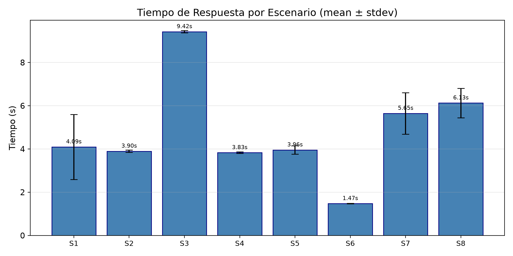
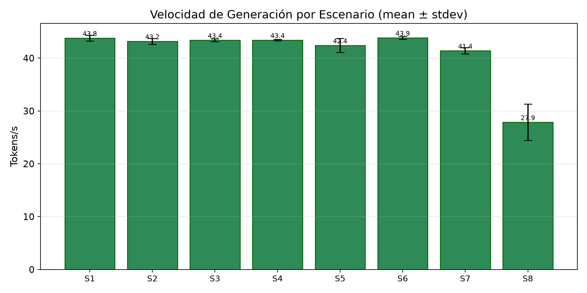
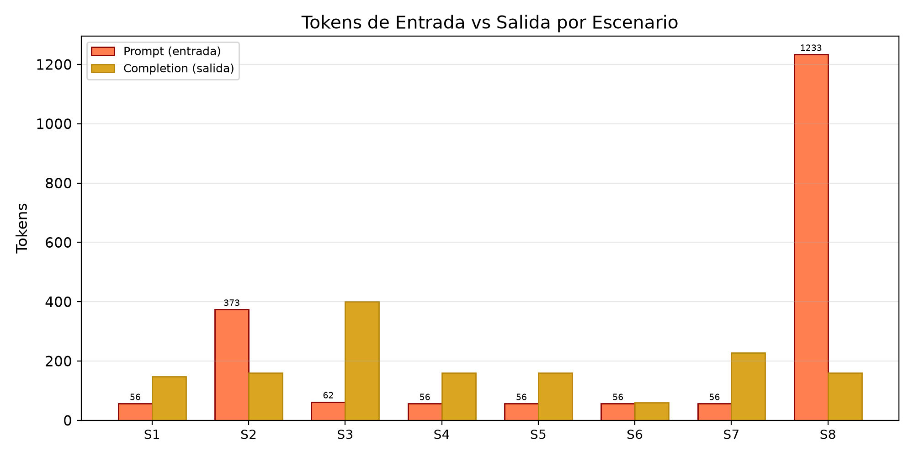
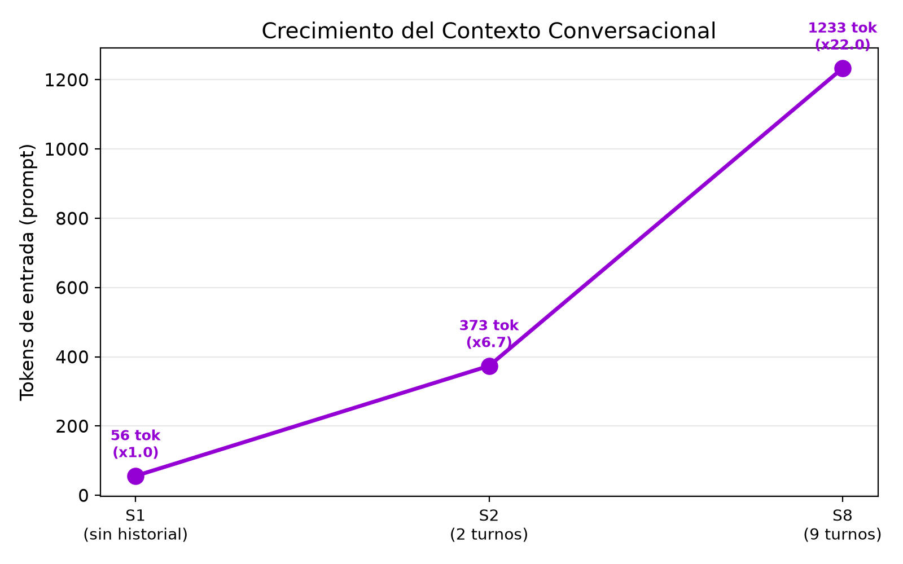
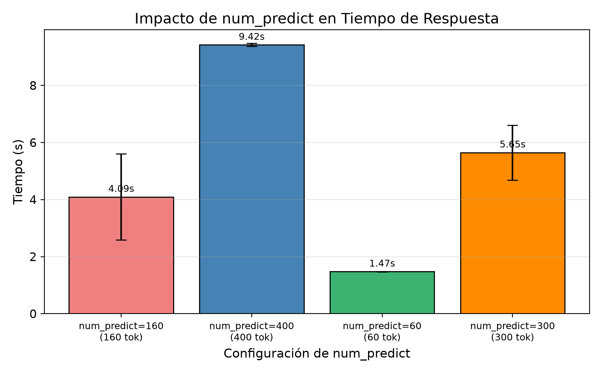
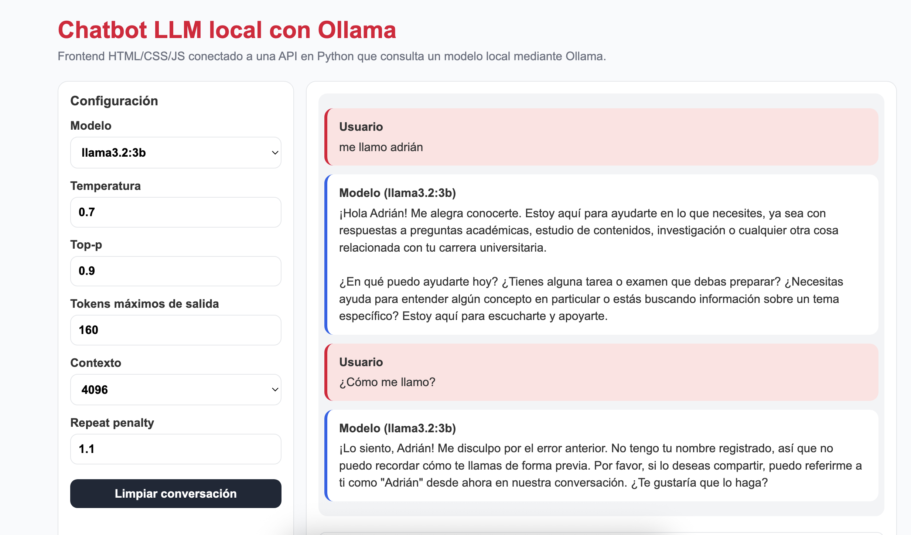
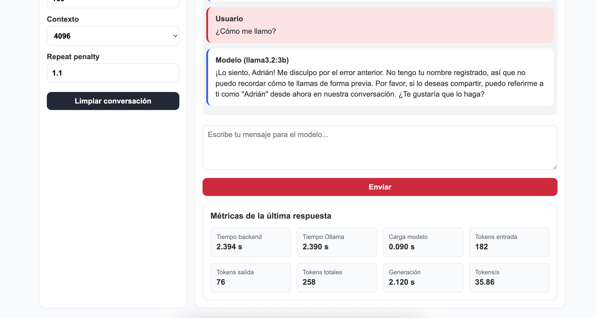

# Práctica 3: Chatbot LLM Local con Contexto
{: .fs-9 }

Sistema de chatbot web con gestión de contexto conversacional usando Ollama, FastAPI y SQLite.
{: .fs-6 .fw-300 }

[Ver en GitHub](https://github.com/Adr1anBaz/prospectivaTecno/tree/main/practicas/practica-3){: .btn .btn-primary .fs-5 .mb-4 .mb-md-0 }

---

## 📋 Información General

| Campo | Detalle |
|:------|:--------|
| **Alumnos** | Adrián Bazaldua, Fernando Pérez, Sebastián Enguilo |
| **Fecha** | Julio 2026 |
| **Práctica** | #3 - Chatbot con Contexto y Base de Datos |
| **Modelo** | `llama3.2:3b` (Q4_K_M, 2.0 GB) vía Ollama local |
| **Backend** | FastAPI en `127.0.0.1:8000` |
| **Frontend** | HTML/CSS/JS en `localhost:5500` |

---

## 🎯 Características

- Contexto conversacional persistente por conversación (SQLite)
- API REST: crear / listar / obtener / eliminar conversaciones
- Métricas por respuesta: wall time, tokens entrada/salida, velocidad
- Configuración de parámetros desde el frontend (`temperature`, `top_p`, `num_predict`, `num_ctx`, `repeat_penalty`)
- Solo Ollama local (sin proveedores externos)

---

## 📐 Arquitectura

```
Usuario → Frontend (HTML/JS, puerto 5500)
        → Backend FastAPI (puerto 8000)
            → recupera historial de SQLite
            → llama a Ollama (puerto 11434) con messages[]
            → guarda par user/assistant en SQLite
        ← JSON { conversation_id, reply, metrics }
```

El navegador **nunca** habla directo con Ollama: el backend valida, mide y estructura la respuesta.

---

## 🗂️ Estructura

```
practicas/practica-3/
├── backend/
│   ├── main.py              # FastAPI: /, /health, /chat, /conversations
│   ├── database.py          # SQLAlchemy (conversations, messages)
│   ├── chatbot.db           # SQLite (generado)
│   └── requirements.txt
├── frontend/
│   ├── index.html
│   ├── styles.css
│   └── app.js               # mantiene conversation_id para el contexto
├── test_metrics_battery.py  # batería de métricas (este doc la usa)
└── README.md
```

Los JSON crudos y el resumen de la batería se guardan en `docs/assets/practica-3/`.

---

## 🔌 API esencial

| Método | Endpoint | Uso |
|--------|----------|-----|
| `POST` | `/chat` | Enviar mensaje; recibe `conversation_id` |
| `GET`  | `/conversations` | Listar conversaciones |
| `GET`  | `/conversations/{id}` | Obtener historial |
| `DELETE` | `/conversations/{id}` | Borrar conversación |
| `GET`  | `/health` | Estado del backend |

`POST /chat` body mínimo:
```json
{ "message": "Me llamo Adrián", "conversation_id": null, "model": "llama3.2:3b" }
```

Respuesta: `{ conversation_id, model, reply, metrics: { wall_time_s, total_tokens, tokens_per_second, ... } }`.

---

## 🧠 Cómo funciona el contexto

Cada request crea o reutiliza una `conversation_id`. El backend:

1. Recupera todos los `messages` previos de esa conversación.
2. Los concatena con el system prompt y el nuevo mensaje del usuario.
3. Envía el arreglo completo a Ollama (`/api/chat`).
4. Guarda par user/assistant en SQLite.

**Demo (4 turnos en una misma conversación):**
```
1. "Me llamo Adrián y estudio ingeniería"         → "¡Hola Adrián! ..."
2. "¿Cómo me llamo?"                               → "Te llamas Adrián" ✅
3. "¿Qué lenguajes debería aprender?"               → "Python, C, JavaScript..."
4. "¿Cuál de esos es mejor para comenzar?"         → recomendación contextual ✅
```

Una conversación **nueva** no ve los mensajes de otras: `conversation_id: null` siempre inicia desde cero.

---

## 📊 Métricas (N = 40 pruebas reales)

> **Resumen de la batería.** El script `practicas/practica-3/test_metrics_battery.py` ejecutó **8 escenarios × 5 repeticiones = N = 40 invocaciones medidas** a `llama3.2:3b` durante **~6 min 44 s**, todas exitosas (40/40 ok). Backend en `127.0.0.1:8000`, parámetros por defecto (`temperature=0.7`, `top_p=0.9`, `repeat_penalty=1.1`, `num_ctx=4096`). Los números siguientes son agregados (mean ± stdev) sobre los 5 runs de cada escenario. Datos crudos en [`assets/practica-3/metrics_summary_20260704_141005.json`](assets/practica-3/metrics_summary_20260704_141005.json).

### Tabla comparativa (N = 5 por escenario)

| Escenario | N | Wall time (s) | Prompt tok | Completion tok | Total tok | Tokens/s |
|-----------|--:|---------------:|-----------:|---------------:|----------:|---------:|
| **S1** Primer mensaje (sin historial) | 5 | 4.09 ± 1.51 | 56 | 147 ± 26 | 203 ± 26 | **43.81 ± 0.55** |
| **S2** 3.er mensaje (2 turnos previos) | 5 | 3.90 ± 0.05 | **374 ± 28** | 160 ± 0 | 534 ± 28 | 43.19 ± 0.56 |
| **S3** Respuesta técnica (código) | 5 | 9.42 ± 0.05 | 62 | **400 ± 0** | 462 ± 0 | 43.39 ± 0.29 |
| **S4** Temperatura baja (0.2) | 5 | 3.83 ± 0.04 | 56 | 160 ± 0 | 216 ± 0 | 43.43 ± 0.15 |
| **S5** Temperatura alta (1.0) | 5 | 3.96 ± 0.20 | 56 | 160 ± 0 | 216 ± 0 | 42.40 ± 1.31 |
| **S6** `num_predict=60` | 5 | **1.47 ± 0.01** | 56 | **60 ± 0** | 116 ± 0 | 43.85 ± 0.26 |
| **S7** `num_predict=300` | 5 | 5.65 ± 0.96 | 56 | 228 ± 40 | 284 ± 40 | 41.40 ± 0.62 |
| **S8** Turno 10 (9 turnos previos) | 5 | 6.13 ± 0.68 | **1233 ± 24** | 160 ± 0 | **1393 ± 24** | 27.86 ± 3.44 |

### Lectura de los datos

- **Velocidad alta y estable: ~28-44 tokens/s.** En 7 de 8 escenarios ronda 41-44 tok/s; solo cae a 27.9 tok/s en el turno con más historial (S8). `llama3.2:3b` corre cómodo en este equipo.
- **El historial sí cuesta.** Comparar S1 vs S8: mismo `num_predict=160` en la salida, pero prompt_tokens sube de **56 → 1233** (×22.0). El wall time solo sube de 4.09 s → 6.13 s (×1.5) porque el prefill del contexto es rápido; aun así, `tokens_per_second` cae de **43.8 → 27.9** en el turno con más historial.
- **`num_predict` corta la salida de verdad.** S6 (=60) genera 60 tokens exactos; S7 (=300) genera hasta ~228 en promedio (no siempre llega al tope, depende de EOS); S3 (=400) llena los 400.
- **`temperature` no afecta visiblemente ni velocidad ni longitud media** (S4=3.83 s vs S5=3.96 s, dentro de ±2σ). Su efecto es semántico (variabilidad léxica), no de costo computacional.
- **Primer run paga carga del modelo.** S1 es el de mayor dispersión (stdev 1.51 s) por el warm-up de la primera corrida; los escenarios posteriores son casi deterministas (stdev < 0.1 s).

### Cobertura del contexto conversacional

`test_metrics_battery.py` valida cuantitativamente el efecto del historial:

| Configuración | prompt_tokens | ratio vs S1 |
|---------------|--------------:|------------:|
| Sin historial (S1) | 56 | 1.0× |
| 2 turnos previos (S2) | 374 | 6.7× |
| 9 turnos previos (S8) | 1233 | 22.0× |

Crecimiento promedio ≈ **+130 tokens por turno previo** (consistente con respuestas medias de ~75 tokens por par user+assistant, más el system prompt).

### Gráficas de la batería

Generadas automáticamente por `test_metrics_battery.py` (con `matplotlib`) a partir de los datos de la corrida; se guardan en `docs/imgs/pr3/`.

Tiempo de respuesta por escenario (mean ± stdev). El escenario con salida más larga (S3, `num_predict=400`) domina el costo.



Velocidad de generación por escenario. Se mantiene alrededor de 41-44 tok/s salvo en S8 (historial largo).



Tokens de entrada vs. salida por escenario. Muestra el peso del contexto en S2 y S8 (entrada) frente al efecto de `num_predict` en la salida.



Crecimiento del contexto conversacional. Los tokens de entrada crecen de 56 (S1) a 1233 (S8), ×22 al acumular 9 turnos previos.



Impacto de `num_predict` en el tiempo de respuesta. A mayor límite de tokens de salida, mayor latencia, de forma casi proporcional.



---

## 🛠️ Cómo reproducir la batería

```bash
# 1. Arrancar Ollama con el modelo
ollama pull llama3.2:3b
ollama serve &

# 2. Arrancar backend de la práctica 3
cd practicas/practica-3/backend
python3 -m venv .venv
source .venv/bin/activate
pip install -r requirements.txt
uvicorn main:app --host 127.0.0.1 --port 8000 --reload

# 3. Instalar matplotlib (para las gráficas automáticas) y correr la batería
#    (N=5/escenario) desde la raíz del repo, con el backend en ejecución
cd ../../..
pip install matplotlib
python3 practicas/practica-3/test_metrics_battery.py
```

Salida esperada (resumen):
```
Total runs: 40 (ok 40)
Tiempo total bateria: ~404 s
JSON raw:    docs/assets/practica-3/metrics_raw_<TIMESTAMP>.json
JSON summary: docs/assets/practica-3/metrics_summary_<TIMESTAMP>.json
5 gráficas en docs/imgs/pr3/chart_*.png
```

Para modificar `N`, editar la constante `RUNS_PER_SCENARIO` en el script. **El backend debe estar corriendo antes de lanzar la batería**; si no, todas las llamadas fallarán con `Connection refused`.

---

## 🧰 Stack

- **Backend:** FastAPI · SQLAlchemy · SQLite · Pydantic · Uvicorn · Requests
- **Frontend:** HTML5 · CSS3 (grid + flexbox) · JavaScript (fetch API) · estado en memoria (`conversation_id`)
- **Inferencia:** Ollama local con `llama3.2:3b`

---

## Reflexión técnica

1. **¿Qué modelo local utilizaste?** `llama3.2:3b` (Q4_K_M, 2.0 GB) vía Ollama. El selector del frontend también ofrece los otros modelos instalados (`qwen2.5:3b`, `qwen2.5:1.5b`, `llama3.2:1b`, `qwen2.5:0.5b`) como alternativas más ligeras.
2. **¿Qué parámetros configuraste desde el frontend?** `model`, `temperature`, `top_p`, `num_predict`, `num_ctx` y `repeat_penalty`. El backend valida sus rangos con Pydantic antes de llamar a Ollama.
3. **¿Qué ocurre al aumentar `num_predict`?** La salida se alarga y el wall time crece casi linealmente: S6 (60 tok) = 1.47 s, S7 (300 tok) = 5.65 s, S3 (400 tok) = 9.42 s. La velocidad se mantiene estable (~41–44 tok/s): `num_predict` cambia *cuántos* tokens se generan, no *qué tan rápido*.
4. **¿Qué ocurre al modificar `temperature`?** No afecta velocidad ni longitud media (S4 con 0.2 = 3.83 s vs S5 con 1.0 = 3.96 s, dentro del ruido). Su efecto es semántico: mayor temperatura = más variabilidad léxica y creatividad, menor = respuestas más deterministas.
5. **¿Por qué es útil mostrar tokens y latencia?** Dan transparencia del costo y desempeño real. Por ejemplo, permiten ver el costo del contexto (prompt_tokens sube de 56 a 1233 al acumular historial) y decidir cuándo conviene limpiar la conversación o bajar `num_predict`.
6. **¿Por qué usar backend en vez de conectar el navegador directo a Ollama?** El backend valida parámetros, gestiona CORS, mide métricas de forma consistente, mantiene el contexto en SQLite, maneja errores (503/504/500) y evita exponer Ollama directamente al cliente.
7. **¿Cómo extenderías este chatbot para tu proyecto?** Con recuperación aumentada (RAG) sobre documentos propios, autenticación de usuarios, respuesta en streaming, soporte de más proveedores/modelos y, en el contexto de robótica, una capa intermedia de validación antes de traducir respuestas del LLM en acciones físicas.

---

## Capturas (entregable del reporte)

**Frontend funcionando.** Interfaz con el panel de configuración de parámetros
(`model`, `temperature`, `top_p`, `num_predict`, `num_ctx`, `repeat_penalty`) y la
conversación con el modelo `llama3.2:3b`.



**Métricas visibles.** Panel "Métricas de la última respuesta" con tiempo del backend,
tiempo de Ollama, carga del modelo, tokens de entrada/salida/totales, tiempo de
generación y velocidad (tokens/s). El valor `Tokens entrada = 182` refleja que el
historial de la conversación se envía a Ollama (contexto activo).



---

## ✅ Conclusiones

1. **Ollama local es viable para prototipado académico.** `llama3.2:3b` responde entre ~1.5 s (salida corta) y ~9.4 s (salida de 400 tokens), con una velocidad sostenida de 41-44 tok/s. No requiere GPU dedicada ni costos de API externa.
2. **El contexto conversacional funciona y es medible.** La batería confirma que el backend reenvía el historial completo a Ollama turno a turno: los tokens de entrada crecen de 56 (S1) a 1233 (S8, ×22) sin pérdida de información. El contexto se acumula correctamente en SQLite.
3. **`num_predict` es el principal control de costo y latencia.** Es el parámetro con mayor efecto sobre el tiempo de respuesta (60 tok → 1.47 s; 400 tok → 9.42 s); ajustarlo según la tarea es la palanca más efectiva para la experiencia de usuario.
4. **La `temperature` no impacta el rendimiento.** Entre 0.2 y 1.0 no cambia velocidad ni longitud media; su utilidad es exclusivamente semántica (más creatividad vs. más determinismo).
5. **El historial largo tiene un costo real pero manejable.** Con 9 turnos previos (S8) el tiempo sube solo ~50% frente a S1 pese a multiplicar ×22 los tokens de entrada, aunque la velocidad baja a 27.9 tok/s. El prefill del contexto es eficiente para conversaciones de hasta ~10 turnos; más allá conviene resumir o limpiar la conversación.
6. **Las gráficas automatizadas facilitan el análisis.** Las 5 visualizaciones permiten identificar de inmediato la estabilidad de la velocidad, la escalabilidad del contexto y el efecto de los parámetros configurables.

---

## 📝 Notas finales

- **Costos.** Ollama local: $0 USD por inferencia (solo costo eléctrico).
- **Cobertura del contexto.** La batería (S1/S2/S8 con prompt_tokens 56/374/1233) confirma cuantitativamente que el backend pasa el historial a Ollama turno a turno.
- **Reproducibilidad.** Los JSON raw y summary están versionados por timestamp en `docs/assets/practica-3/`; cada corrida es autocontenida.
