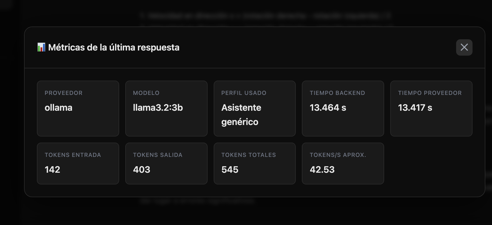
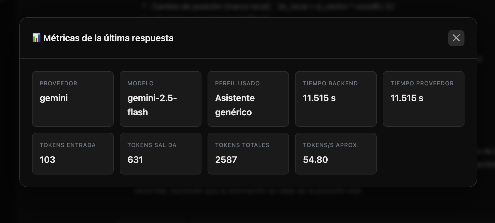
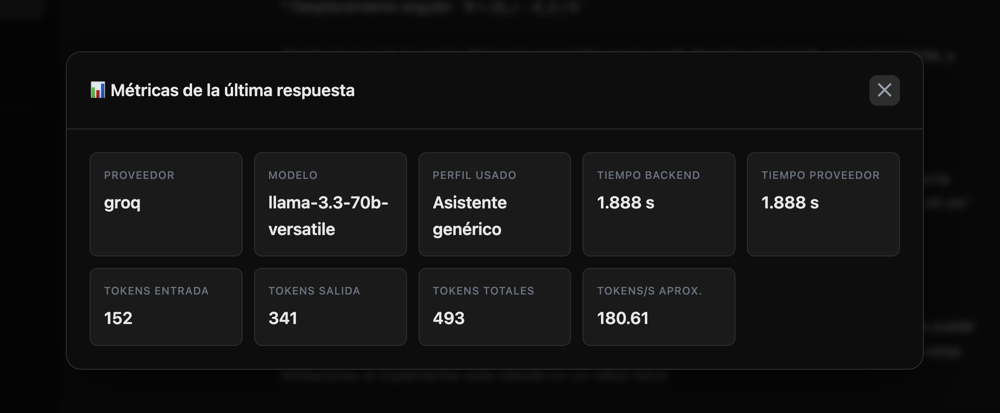

# Práctica 4: Chatbot Híbrido con APIs Externas
{: .fs-9 }

Comparación de modelos LLM: Ollama local, Google Gemini API y Groq API usando un chatbot con perfiles de copiloto
{: .fs-6 .fw-300 }

[Ver en GitHub](https://github.com/Adr1anBaz/prospectivaTecno/tree/main/practicas/practica-4){: .btn .btn-primary .fs-5 .mb-4 .mb-md-0 }

---

## Información General

| Campo | Detalle |
|:------|:--------|
| **Alumnos** | Adrián Bazaldua, Fernando Pérez, Sebastián Enguilo |
| **Fecha** | Junio 2026 |
| **Práctica** | #4 - Chatbot Híbrido con APIs Externas |

---

## Objetivo

Modificar el chatbot/copiloto desarrollado en prácticas anteriores para que pueda conversar con un modelo local en Ollama y con al menos dos modelos remotos mediante APIs externas. El objetivo es comparar velocidad, costo, tamaño del modelo, tokens, privacidad, facilidad de integración y dependencia de internet.

---

## Arquitectura del Sistema

```
Usuario
→ Frontend web (HTML/CSS/JS en puerto 5500)
   - Selector de proveedor (Ollama, Gemini, Groq, OpenRouter)
   - Selector de modelo dinámico
   - Selector de perfil de copiloto
   - Parámetros configurables (temperature, top_p, max_tokens)
→ Backend Python (FastAPI en puerto 8000)
   - Valida proveedor y perfil
   - Construye mensajes con system prompt
   - Enruta al proveedor seleccionado
   - Normaliza métricas de respuesta
→ Proveedor de inferencia:
   - Ollama local (puerto 11434)
   - Google Gemini API (remoto)
   - Groq API (remoto)
```

---

## Estructura del Proyecto

```
practica-4/
├── backend/
│   ├── main.py              # API intermedia FastAPI
│   ├── requirements.txt     # Dependencias Python
│   ├── .env                 # API keys (no se sube a git)
│   └── .env.example         # Plantilla de llaves
└── frontend/
    ├── index.html           # Interfaz del chatbot
    ├── styles.css           # Estilos visuales
    └── app.js               # Comunicación con backend
```

---

## Proveedores Utilizados

| Proveedor | Modelo | Tipo | Ventaja |
|-----------|--------|------|---------|
| Ollama local | `llama3.2:3b` | Abierto/local | Control, privacidad, bajo costo |
| Google Gemini API | `gemini-2.5-flash` | Cerrado/remoto | Calidad, capacidades avanzadas |
| Groq API | `llama-3.3-70b-versatile` | Abierto/remoto | 70B parámetros, alta velocidad |

---

## Prueba Realizada

Se realizaron 150 pruebas (50 por proveedor) usando el mismo prompt en los tres proveedores con la siguiente configuración:

**Prompt:**
```
Explica qué es la odometría diferencial en un robot móvil de dos ruedas.
Incluye:
1. explicación conceptual;
2. ecuaciones básicas;
3. ejemplo para estudiantes de ingeniería;
4. una limitación práctica.
Responde en máximo 250 palabras.
```

**Configuración:**

| Parámetro | Valor |
|-----------|-------|
| `temperature` | 0.7 |
| `top_p` | 0.9 |
| `max_tokens` | 300 |
| Perfil | Asistente genérico |

---

## Capturas de Métricas

### Ollama Local (llama3.2:3b)



### Gemini API (gemini-2.5-flash)



### Groq API (llama-3.3-70b-versatile)



---

## Tabla de Métricas Comparativas

| Variable | Ollama local | Gemini API | Groq API |
|----------|-------------:|-----------:|---------:|
| Proveedor | Ollama | Google | Groq |
| Modelo | `llama3.2:3b` | `gemini-2.5-flash` | `llama-3.3-70b-versatile` |
| Tipo | Abierto/local | Cerrado/remoto | Abierto/remoto |
| Parámetros | 3B aprox. | No divulgado | 70B |
| Tokens entrada | 142 | 103 | 152 |
| Tokens salida | 403 | 631 | 341 |
| Tokens totales | 545 | 2587 | 493 |
| Tiempo total | 13.464 s | 11.515 s | 1.888 s |
| Tokens/s | 42.53 | 54.80 | 180.61 |
| Requiere internet | No | Sí | Sí |
| Requiere API key | No | Sí | Sí |
| Tiene costo | Hardware local | Tier gratuito limitado / pago | Free plan limitado / pago |
| Privacidad | Alta | Depende del proveedor | Depende del proveedor |
| Pruebas realizadas | 50 | 50 | 50 |

---

## Respuestas Obtenidas

### Respuesta de Ollama Local (llama3.2:3b)

> La odometría diferencial es un algoritmo utilizado en robots móviles para calcular la posición y el movimiento del vehículo a partir de los sensores de velocidad y dirección.
>
> **Ecuaciones básicas:**
> 1. Velocidad en dirección x = (rotación derecha - rotación izquierda) / 2
> 2. Velocidad en dirección y = (rotación derecha + rotación izquierda) / 2
> 3. Posición en x = posición anterior en x + velocidad en x * tiempo
> 4. Posición en y = posición anterior en y + velocidad en y * tiempo
>
> **Limitación:** La odometría diferencial supone que el robot gira a la misma velocidad en ambas direcciones, lo que no siempre es posible. Cuando un robot se detiene o cambia de dirección, puede dar lugar a errores significativos.

### Respuesta de Gemini API (gemini-2.5-flash)

> La odometría diferencial es una técnica para estimar la posición y orientación de un robot móvil con dos ruedas motrices e independientes, utilizando datos de sus encoders.
>
> **Ecuaciones básicas:**
> - Distancia rueda izquierda: `dL_dist = encoder_L * radio_rueda`
> - Distancia rueda derecha: `dR_dist = encoder_R * radio_rueda`
> - Cambio de orientación: `dθ = (dR_dist - dL_dist) / ancho_robot`
> - Distancia del centro: `d_centro = (dR_dist + dL_dist) / 2`
>
> **Ejemplo:** Un robot (ancho=0.5m, radio=0.1m) gira la rueda izquierda 1 rad y la derecha 2 rad. dL_dist = 0.1m, dR_dist = 0.2m, dθ = 0.2 rad, d_centro = 0.15m.
>
> **Limitación:** La principal es la acumulación de errores. Pequeños deslizamientos de las ruedas, imprecisiones en los encoders y superficies irregulares causan un "drift" en la posición estimada que se magnifica con el tiempo.

### Respuesta de Groq API (llama-3.3-70b-versatile)

> La odometría diferencial es un método para calcular la posición y orientación de un robot móvil de dos ruedas basado en la medición de la distancia recorrida por cada rueda y la diferencia entre ellas.
>
> **Ecuaciones básicas:**
> - Desplazamiento lineal: `x = (d_r + d_l) / 2`
> - Desplazamiento angular: `θ = (d_r - d_l) / b`
>
> **Ejemplo:** Un robot con ruedas de 10 cm de diámetro y 20 cm de distancia entre ellas. Si la rueda derecha recorre 50 cm y la izquierda 40 cm: x = 45 cm, θ = 0.5 rad.
>
> **Limitación:** La fricción y el deslizamiento de las ruedas pueden provocar errores en la estimación de la posición y orientación del robot.

---

## Evaluación Cualitativa

| Criterio | Ollama local | Gemini API | Groq API |
|----------|:------------:|:----------:|:--------:|
| Claridad conceptual | 3 | 5 | 4 |
| Precisión técnica | 2 | 5 | 4 |
| Uso correcto de ecuaciones | 2 | 5 | 4 |
| Calidad del ejemplo | 2 | 5 | 4 |
| Nivel adecuado para ingeniería | 3 | 5 | 4 |
| Identificación de limitaciones | 3 | 5 | 3 |
| Alucinaciones o errores | 2 | 5 | 4 |
| Utilidad final | 2 | 5 | 4 |

Escala: 1=deficiente, 2=básico, 3=aceptable, 4=bueno, 5=excelente

---

## Análisis Comparativo

Resultados basados en 150 pruebas (50 por proveedor).

### 1. Velocidad

Groq fue el proveedor más rápido con **180.61 tokens/s** y un tiempo total de **1.888 s**. Gemini fue moderado con 54.80 tokens/s (11.5 s). Ollama local fue el más lento con 42.53 tokens/s (13.4 s), limitado por el hardware disponible.

### 2. Calidad de Respuesta

Gemini (gemini-2.5-flash) generó la respuesta más completa y precisa técnicamente, incluyendo ecuaciones detalladas, un ejemplo numérico claro y una explicación profunda de las limitaciones. Groq (llama-3.3-70b) dio una respuesta concisa y correcta. Ollama local (llama3.2:3b) fue la más débil, con ecuaciones simplificadas y algunas imprecisiones.

### 3. Relación Tamaño vs. Calidad

El modelo más grande (70B en Groq) no superó al modelo cerrado de Gemini en calidad, aunque fue significativamente más rápido. El modelo local de 3B fue notablemente inferior en precisión técnica, lo que confirma que el tamaño del modelo impacta directamente la calidad de las respuestas.

### 4. Privacidad vs. Rendimiento

Ollama local ofrece la máxima privacidad (datos no salen del equipo) pero con menor rendimiento y calidad. Las APIs externas ofrecen mejor rendimiento a costa de enviar los prompts a servidores de terceros.

### 5. Facilidad de Integración

Groq y OpenRouter usan formato compatible con OpenAI, lo que facilita la integración. Gemini requiere su propio SDK (`google-genai`). Ollama tiene una API local simple pero requiere instalación del modelo.

---

## Conclusiones

Con base en 150 pruebas (50 por proveedor):

1. **No hay un proveedor universalmente mejor**: la elección depende del caso de uso (privacidad, velocidad, calidad, costo).
2. **Groq destaca en velocidad**: su infraestructura optimizada (LPU) permite inferencia extremadamente rápida.
3. **Gemini destaca en calidad**: para tareas que requieren precisión técnica, los modelos cerrados de frontera siguen siendo superiores.
4. **Ollama local es viable para desarrollo y privacidad**: aunque su rendimiento es menor, no depende de internet ni tiene costos por token.
5. **La arquitectura híbrida es la más flexible**: permite elegir el proveedor adecuado según el contexto de cada consulta.

---

## Instalación y Uso

### Requisitos

1. Python 3.8+
2. Ollama instalado con modelo `llama3.2:3b`
3. API keys de Gemini y Groq

### Backend

```bash
cd backend
python -m venv .venv
source .venv/bin/activate  # macOS/Linux
pip install -r requirements.txt

# Configurar .env con las API keys
cp .env.example .env
# Editar .env con las llaves reales

uvicorn main:app --reload --port 8000
```

### Frontend

```bash
cd frontend
python -m http.server 5500
```

Abrir: `http://localhost:5500`

---

## Tecnologías Utilizadas

| Componente | Tecnología |
|------------|------------|
| Backend | FastAPI, Pydantic, python-dotenv |
| APIs externas | google-genai, openai (SDK compatible) |
| Frontend | HTML5, CSS3, JavaScript ES6+ |
| LLM local | Ollama + llama3.2:3b |
| LLM remoto | Gemini 2.5 Flash, Llama 3.3 70B (Groq) |

---

**Fecha de elaboración:** Junio 2026  
**Autores:** Adrián Bazaldua, Fernando Pérez, Sebastián Enguilo  
**Curso:** IA Generativa y Prospectiva Tecnológica

{: .note }
> Este chatbot híbrido permite comparar modelos locales y remotos en una misma interfaz.
> Las API keys nunca se exponen en el frontend y se gestionan mediante variables de entorno.
