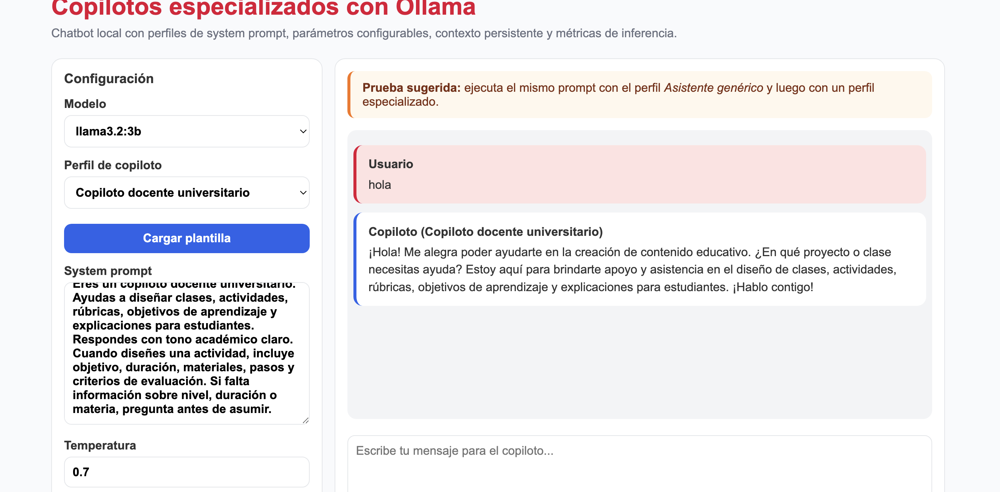
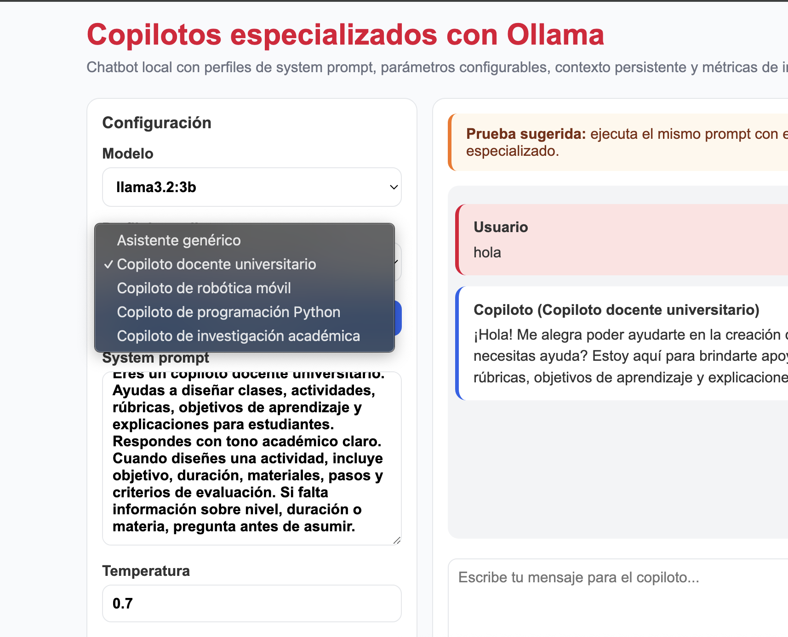

# Práctica 4: Copilotos especializados con Ollama
{: .fs-9 }

Conversión del chatbot local del Tema 3 en un copiloto especializado mediante perfiles de instrucción de sistema, parámetros configurables y evaluación crítica de respuestas.
{: .fs-6 .fw-300 }

[Ver en GitHub](https://github.com/Adr1anBaz/prospectivaTecno/tree/main/practicas/practica-4){: .btn .btn-primary .fs-5 .mb-4 .mb-md-0 }

---

## Objetivo

Modificar el chatbot cliente-servidor del Tema 3 para convertirlo en un copiloto especializado. El comportamiento del modelo se controla mediante un `system_prompt` persistente (identidad, rol, reglas, límites y formato) seleccionable por perfil desde el frontend, sin reentrenar el modelo. Se compara el comportamiento genérico contra el especializado y se evalúan calidad, formato, alucinaciones y latencia.

## Arquitectura

Se conserva la arquitectura de tres capas de la Práctica 3 y se añade la capa de perfiles de copiloto.

| Capa | Tecnología | Función |
|------|------------|---------|
| Frontend | HTML, CSS, JavaScript | Selección de perfil, edición del `system_prompt`, parámetros y visualización de respuesta y métricas |
| Backend | Python, FastAPI, Pydantic | Validación, resolución del perfil, construcción de `messages`, medición de métricas |
| Persistencia | SQLite (SQLAlchemy) | Historial de conversación para mantener contexto entre turnos |
| Inferencia | Ollama (`/api/chat`) | Ejecución del modelo local |

El backend coloca el `system_prompt` del perfil como `messages[0]`, seguido del historial de la conversación y el mensaje del usuario.

## Perfiles de copiloto

Se definieron cinco perfiles en el backend, expuestos vía `GET /profiles`. El frontend carga su plantilla y permite editarla antes de enviar.

| Perfil (`id`) | Etiqueta | Enfoque |
|---------------|----------|---------|
| `generico` | Asistente genérico | Asistente académico general, sin especialización |
| `docente` | Copiloto docente universitario | Actividades, rúbricas y objetivos; exige objetivo, duración, materiales, pasos y criterios |
| `robotica` | Copiloto de robótica móvil | Sensores, actuadores y control; debe pedir datos eléctricos faltantes y advertir riesgos |
| `programacion` | Copiloto de programación Python | Código comentado; ante un error: interpreta, propone causa y da corrección verificable |
| `investigacion` | Copiloto de investigación académica | Preguntas y marcos teóricos; separa hechos/inferencias y prohíbe inventar citas |

## API

| Método | Endpoint | Uso |
|--------|----------|-----|
| `GET` | `/profiles` | Lista perfiles y sus `system_prompt` |
| `POST` | `/chat` | Envía mensaje; devuelve respuesta, perfil usado y métricas |
| `GET` | `/conversations` | Lista conversaciones |
| `GET` | `/conversations/{id}` | Historial de una conversación |
| `DELETE` | `/conversations/{id}` | Elimina una conversación |

La respuesta de `POST /chat` incluye `copilot_profile`, `copilot_label`, `system_prompt_used`, `reply` y el bloque `metrics`.

## Parámetros configurables

| Parámetro | Rango | Función |
|-----------|-------|---------|
| `model` | modelos instalados | Selección del LLM local |
| `copilot_profile` | 5 perfiles | Identidad y rol del copiloto |
| `system_prompt` | texto editable | Instrucción de sistema (`messages[0]`) |
| `temperature` | 0.0 – 1.2 | Aleatoriedad |
| `top_p` | 0.1 – 1.0 | Diversidad probabilística |
| `num_predict` | 20 – 1000 | Longitud máxima de salida |
| `num_ctx` | 2048 / 4096 / 8192 | Ventana de contexto |
| `repeat_penalty` | 1.0 – 2.0 | Penalización de repeticiones |

## Metodología de pruebas

Se ejecutó una batería automatizada (`practicas/practica-4/test_prompting_battery.py`) contra el backend en `http://127.0.0.1:8000/chat`. Cada prompt de dominio se envió dos veces con parámetros idénticos: una con el perfil `generico` y otra con el perfil especializado correspondiente, para permitir la comparación directa. Cada corrida usó `conversation_id: null` (conversación nueva), de modo que no hubo contexto acumulado entre pruebas.

- Modelo: `llama3.2:3b` (Ollama local).
- Parámetros fijos: `temperature=0.7`, `top_p=0.9`, `num_predict=180`, `num_ctx=4096`, `repeat_penalty=1.1`.
- 12 prompts de dominio (3 por perfil especializado) × 2 perfiles = 24 corridas.
- Métricas registradas por corrida directamente del backend: tokens de salida (`eval_count`), latencia de backend (`wall_time_s`), tokens de entrada, tokens totales y tokens/s.
- Las columnas cualitativas (cumple rol, cumple formato, alucina) se determinaron leyendo la respuesta real de cada corrida; no se generaron datos sintéticos.

Los resultados crudos y el resumen se guardan en `docs/assets/practica-4/`.

## Promedios por perfil

| Perfil | Corridas | Tokens salida (prom.) | Latencia s (prom.) | Tokens/s (prom.) |
|--------|:--------:|:---------------------:|:------------------:|:----------------:|
| `generico` | 12 | 180.0 | 5.383 | 36.11 |
| `docente` | 3 | 180.0 | 5.489 | 35.91 |
| `robotica` | 3 | 180.0 | 5.575 | 35.86 |
| `programacion` | 3 | 180.0 | 5.499 | 35.94 |
| `investigacion` | 3 | 169.7 | 5.226 | 35.77 |

La latencia y el rendimiento (tokens/s) son prácticamente iguales entre perfiles: el perfil no cambia el costo de inferencia, solo el contenido. La mayoría de respuestas alcanzaron el tope de `num_predict=180` tokens; la excepción fue una corrida de `investigacion` que terminó antes (149 tokens).

## Tabla de pruebas

Prompts (identificador usado en la tabla):

- P1: Actividad de clase para introducir sensores (primer semestre de ingeniería)
- P2: Rúbrica para evaluar un reporte de laboratorio de robótica
- P3: Tres objetivos de aprendizaje para una unidad de control de motores
- P4: Conexión de un sensor ultrasónico HC-SR04 a un microcontrolador
- P5: Diferencia entre motor DC y servomotor para un robot móvil
- P6: Precauciones al alimentar un driver de motores con batería LiPo
- P7: Función en Python para calcular el promedio de una lista
- P8: Explicar y corregir `IndexError: list index out of range`
- P9: Leer un CSV en Python y sumar una columna
- P10: Formular una pregunta de investigación (robots educativos en primaria)
- P11: Elementos de un marco teórico (visión por computadora)
- P12: Cita textual con autor y año (aprendizaje basado en proyectos)

| Prompt | Perfil | Cumple rol | Cumple formato | Alucina | Tokens salida | Latencia (s) | Observación |
|--------|--------|:----------:|:--------------:|:-------:|:-------------:|:------------:|-------------|
| P1 | `generico` | n/a | Sí | No | 180 | 5.357 | Estructura la actividad (objetivo, nivel, duración, materiales, pasos) pese a no tener rol |
| P1 | `docente` | Sí | Parcial | No | 180 | 5.387 | Añade objetivos múltiples y nivel explícito; se trunca antes de pasos y criterios por `num_predict` |
| P2 | `generico` | n/a | Sí | No | 180 | 5.292 | Rúbrica con puntajes por sección |
| P2 | `docente` | Sí | Sí | No | 180 | 5.507 | Incorpora objetivo y criterios de evaluación explícitos |
| P3 | `generico` | n/a | Sí | No | 180 | 5.577 | Tres objetivos; ligera deriva hacia sensores en vez de motores |
| P3 | `docente` | Sí | Sí | No | 180 | 5.572 | Añade nivel, duración, materiales y actividades |
| P4 | `generico` | n/a | Sí | Leve | 180 | 5.305 | Lista pines y componentes; imprecisiones ("cables USB/serial", resistencias genéricas) |
| P4 | `robotica` | Parcial | Sí | Sí | 180 | 5.462 | No solicitó datos faltantes como exige el perfil; términos erróneos ("vórtice rojo") |
| P5 | `generico` | n/a | Sí | Leve | 180 | 5.384 | Expande DC como "Dínamo Continuo" (incorrecto) |
| P5 | `robotica` | Sí | Sí | Leve | 180 | 5.565 | Tono técnico correcto; expande DC como "Dínamo Cónica" (incorrecto) |
| P6 | `generico` | n/a | Sí | Leve | 180 | 5.415 | Precauciones razonables; equipara LiPo a "iones de litio" |
| P6 | `robotica` | Sí | Sí | Sí | 180 | 5.698 | Incluye advertencias de incendio (correcto); expande LiPo como "Lithio Polivinilo" (incorrecto) |
| P7 | `generico` | n/a | Sí | No | 180 | 5.530 | Función correcta con docstring |
| P7 | `programacion` | Sí | Sí | No | 180 | 5.647 | Función correcta, comentada paso a paso |
| P8 | `generico` | n/a | Sí | No | 180 | 5.434 | Explicación correcta del error con ejemplo |
| P8 | `programacion` | Sí | Sí | No | 180 | 5.372 | Sigue la estructura del perfil: interpreta, causa probable y corrección verificable |
| P9 | `generico` | n/a | Sí | Leve | 180 | 5.288 | Usa `cumsum()` (suma acumulada) en lugar de `sum()` (total) |
| P9 | `programacion` | Sí | Sí | No | 180 | 5.477 | Usa `try/except` y valida la existencia de la columna |
| P10 | `generico` | n/a | Sí | No | 180 | 5.333 | Propone preguntas de investigación pertinentes |
| P10 | `investigacion` | Sí | Sí | No | 180 | 5.439 | Preguntas estructuradas con justificación |
| P11 | `generico` | n/a | Sí | No | 180 | 5.351 | Lista elementos del marco teórico |
| P11 | `investigacion` | Sí | Sí | No | 180 | 5.558 | Elementos organizados y ampliados por sección |
| P12 | `generico` | n/a | Sí | Sí | 180 | 5.331 | Inventa autores, año y publicación inexistentes |
| P12 | `investigacion` | Parcial | Sí | Sí | 149 | 4.680 | Inventa cita y referencia; incumple su regla explícita de no inventar citas |

Nota: "n/a" indica que el perfil genérico no define un rol especializado. "Parcial" en formato indica respuestas truncadas por `num_predict=180` antes de completar toda la plantilla exigida.

## Comparación genérico vs. especializado

- El perfil especializado no mejora la velocidad ni cambia significativamente la longitud (véase promedios), pero sí el contenido: incorpora las convenciones del dominio definidas en su `system_prompt`.
- `docente` agrega sistemáticamente objetivo, nivel, duración, materiales y criterios de evaluación (P1–P3), frente a respuestas correctas pero menos estructuradas del genérico.
- `programacion` aporta la mayor diferencia de calidad: en P8 sigue la secuencia interpretar → causa probable → corrección verificable, y en P9 valida la columna con `try/except`, mientras el genérico usó una operación equivocada (`cumsum`).
- `robotica` adopta el tono técnico y las advertencias de seguridad, pero no cumplió la regla de solicitar datos faltantes (P4) y arrastró imprecisiones de siglas (P5, P6).
- En P12 la especialización no evitó la alucinación: ambos perfiles fabricaron citas, incluido `investigacion`, cuyo `system_prompt` lo prohíbe expresamente.

## Capturas

Interfaz con el panel de configuración (modelo, perfil de copiloto, botón "Cargar plantilla", `system_prompt` editable y parámetros) y la conversación con el perfil docente.



Selector de perfil desplegado con los cinco perfiles disponibles.



## Reflexión técnica

1. **¿Qué perfil fue más útil y por qué?** El de programación. En sus tres pruebas mantuvo el rol y el formato exigidos (código comentado; secuencia error → causa probable → corrección verificable) y no presentó alucinaciones. El perfil docente también fue consistente al imponer una estructura pedagógica completa.

2. **¿Qué diferencias observaste entre prompt genérico y `system_prompt` especializado?** La diferencia es cualitativa, no de costo. El genérico produce respuestas plausibles y bien formateadas, pero sin las convenciones del dominio. El especializado añade estructura (docente), procedimiento de depuración (programación) y advertencias de seguridad (robótica). Tokens y latencia son casi idénticos entre ambos.

3. **¿Qué instrucciones redujeron ambigüedad?** Las que fijan un formato explícito: "incluye objetivo, duración, materiales, pasos y criterios" (docente) y "primero interpreta el mensaje, luego causa probable y finalmente corrección verificable" (programación). Su efecto es directamente observable en las corridas de P8, P4 (rúbrica) y P2.

4. **¿Qué instrucciones hicieron la respuesta demasiado rígida?** La plantilla fija del perfil docente. En P3 ("redacta tres objetivos") el modelo agregó duración y materiales no solicitados; con `num_predict=180`, esa rigidez consume tokens antes de completar lo pedido, generando respuestas truncadas.

5. **¿El modelo inventó información? ¿En qué caso?** Sí. En P12 (cita textual) tanto el perfil genérico como el de investigación fabricaron autores, año y publicación inexistentes, a pesar de que el perfil de investigación prohíbe explícitamente inventar citas. También se observaron imprecisiones técnicas menores en la expansión de siglas (DC en P5, LiPo en P6). El `system_prompt` reduce, pero no elimina, las alucinaciones en un modelo de 3B parámetros.

6. **¿Qué guardrails agregarías?** Validación en el backend que marque como "sin verificar" toda respuesta que afirme citas o referencias; detección de patrones de referencia bibliográfica; rechazo cortés de consultas fuera de dominio; y, para robótica, forzar la solicitud de datos faltantes (voltaje, corriente, modelo, diagrama) antes de emitir instrucciones eléctricas, dado que el modelo no respetó esa regla de forma fiable.

7. **¿Cómo conectarías este copiloto con documentos propios en un sistema RAG?** Indexando los documentos (manuales, apuntes, artículos) en una base vectorial; en cada consulta se recuperan los fragmentos más relevantes y se anexan como contexto en `messages` junto al `system_prompt` del perfil, instruyendo al modelo a citar únicamente esas fuentes recuperadas y a responder "no encontrado en las fuentes" cuando no haya evidencia. Esto ataca directamente la alucinación de citas observada en P12.

## Conclusiones

La especialización mediante `system_prompt` adapta el comportamiento del modelo local a un dominio sin reentrenarlo y con costo de inferencia equivalente. Su efecto es claro en estructura y adherencia al rol (docente, programación), moderado cuando el modelo no respeta reglas condicionales (robótica) e insuficiente frente a la fabricación de datos verificables (citas). Un copiloto confiable requiere combinar instrucciones de sistema claras con validación en el backend, límites de seguridad, evaluación humana, métricas de desempeño y, para conocimiento factual, recuperación aumentada (RAG).

## Reproducir la batería

Con Ollama y el backend en ejecución:

```bash
# Backend (terminal 1)
cd practicas/practica-4/backend
python3 -m venv .venv
source .venv/bin/activate
pip install -r requirements.txt
uvicorn main:app --reload --port 8000

# Batería (terminal 2)
python practicas/practica-4/test_prompting_battery.py
```

Los archivos `metrics_raw_<timestamp>.json` y `metrics_summary_<timestamp>.json` se generan en `docs/assets/practica-4/`.
