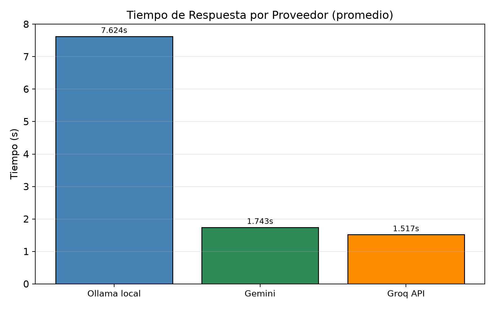
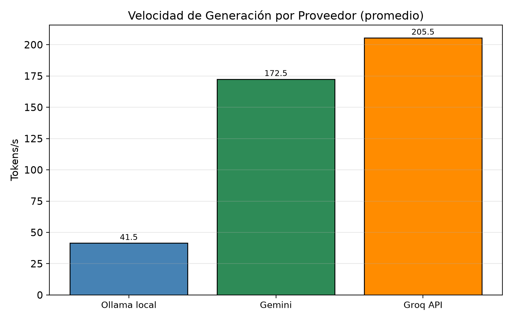
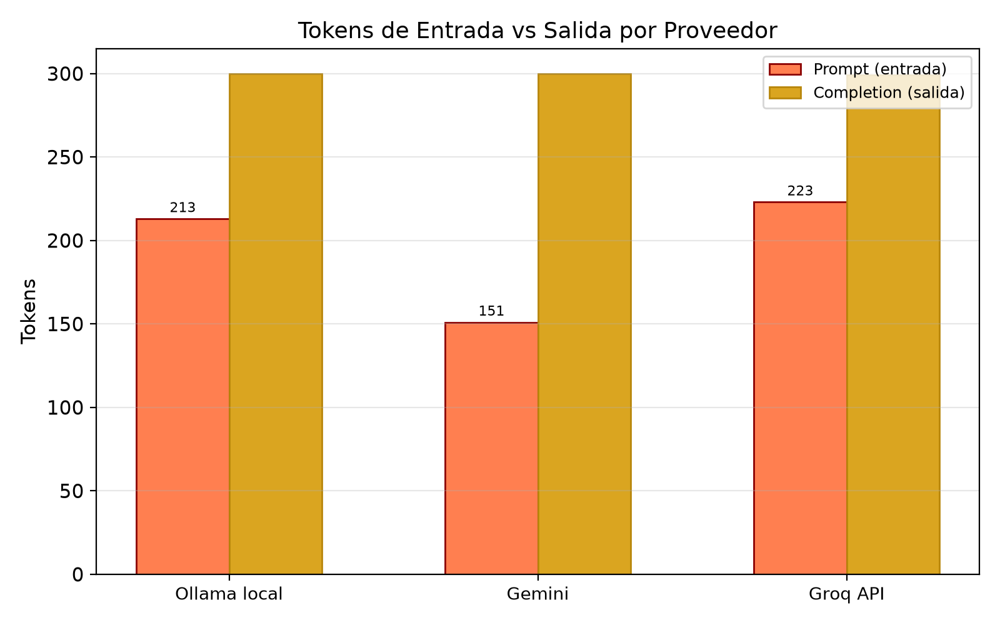
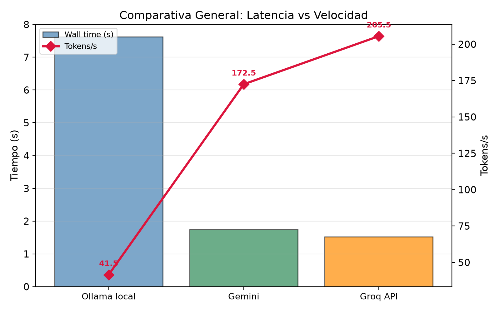
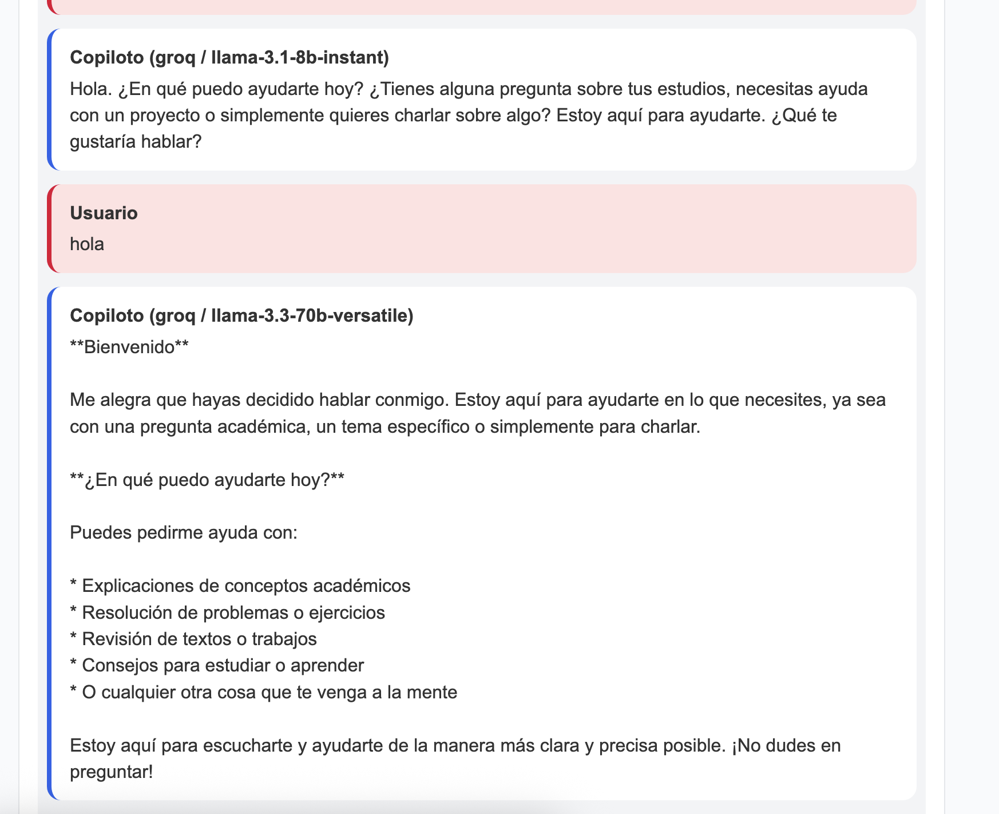
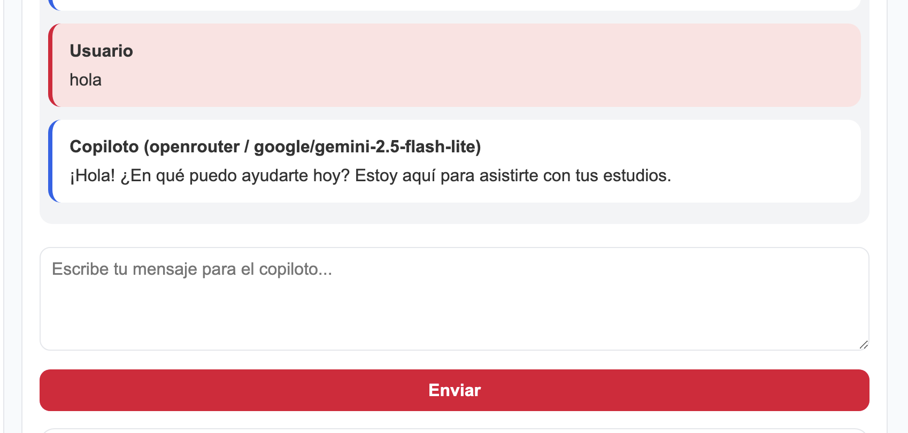

# Práctica 5: Chatbot híbrido con Ollama y APIs externas
{: .fs-9 }

Extensión del copiloto del Tema 4 para conversar con un modelo local (Ollama) y con modelos remotos mediante APIs externas, con selección de proveedor y modelo, perfiles de copiloto, parámetros configurables y métricas normalizadas de inferencia.
{: .fs-6 .fw-300 }

[Ver en GitHub](https://github.com/Adr1anBaz/prospectivaTecno/tree/main/practicas/practica-5){: .btn .btn-primary .fs-5 .mb-4 .mb-md-0 }

---

## Objetivo

Modificar el chatbot cliente-servidor del Tema 4 para que pueda conversar con un modelo local en Ollama y con al menos dos modelos remotos mediante APIs externas. El backend actúa como capa intermedia: recibe siempre el mismo formato de petición, selecciona la función del proveedor correspondiente y normaliza las respuestas y métricas a un esquema común, de modo que un modelo local pequeño pueda compararse de forma directa con modelos remotos de mayor tamaño.

## Arquitectura

Se conserva la arquitectura cliente-servidor del Tema 4 y se sustituye la capa de inferencia única por una capa intermedia multiproveedor. La práctica es sin estado (cada petición es independiente) para que la comparación entre proveedores con el mismo prompt sea limpia.

| Capa | Tecnología | Función |
|------|------------|---------|
| Frontend | HTML, CSS, JavaScript | Selección de proveedor y modelo, perfil de copiloto, edición del `system_prompt`, parámetros y visualización de respuesta y métricas |
| Backend | Python, FastAPI, Pydantic | Validación, resolución de perfil, construcción de `messages`, enrutamiento por proveedor y normalización de métricas |
| Inferencia local | Ollama (`/api/chat`) | Ejecución del modelo local |
| Inferencia remota | Google Gemini (`google-genai`), Groq y OpenRouter (SDK compatible con OpenAI) | Ejecución de modelos remotos |

El request incluye el campo `provider` (`ollama`, `gemini`, `groq` u `openrouter`). El backend selecciona la función correspondiente (`call_ollama`, `call_gemini` o `call_openai_compatible`) y devuelve las métricas en un esquema común.

## Proveedores y modelos evaluados

| Proveedor (`provider`) | Modelo | Tipo | Requiere API key |
|------------------------|--------|------|------------------|
| `ollama` | `llama3.2:3b` | Abierto / local | No |
| `openrouter` | `google/gemini-2.5-flash-lite` | Cerrado / remoto | Sí (`OPENROUTER_API_KEY`) |
| `groq` | `llama-3.3-70b-versatile` | Abierto / remoto | Sí (`GROQ_API_KEY`) |

Nota sobre Gemini: no se dispone de una `GEMINI_API_KEY` directa de Google AI Studio, por lo que la columna correspondiente a Gemini se cubre accediendo al modelo `google/gemini-2.5-flash-lite` a través de OpenRouter. El proveedor `gemini` directo (mediante `google-genai`) está implementado en el backend y queda disponible al definir `GEMINI_API_KEY`.

## API

| Método | Endpoint | Uso |
|--------|----------|-----|
| `GET` | `/` | Información general de la API |
| `GET` | `/health` | Estado del servicio |
| `GET` | `/profiles` | Lista perfiles y sus `system_prompt` |
| `GET` | `/providers` | Lista proveedores y sus modelos disponibles |
| `POST` | `/chat` | Envía mensaje al proveedor y modelo seleccionados; devuelve respuesta y métricas |

La respuesta de `POST /chat` incluye `provider`, `model`, `copilot_profile`, `copilot_label`, `system_prompt_used`, `reply` y el bloque `metrics`.

## Parámetros configurables

| Parámetro | Rango | Ámbito |
|-----------|-------|--------|
| `provider` | `ollama`, `gemini`, `groq`, `openrouter` | Todos |
| `model` | Según proveedor (`GET /providers`) | Todos |
| `copilot_profile` | 5 perfiles | Todos |
| `system_prompt` | Texto editable | Todos |
| `temperature` | 0.0 – 1.2 | Todos |
| `top_p` | 0.1 – 1.0 | Todos |
| `max_tokens` | 20 – 1000 | Todos |
| `num_ctx` | 2048 / 4096 / 8192 | Solo Ollama |
| `repeat_penalty` | 1.0 – 2.0 | Solo Ollama |

## Métricas normalizadas

Cada respuesta reporta un esquema común independiente del proveedor: `wall_time_s` (tiempo medido por el backend), `provider_duration_s`, `prompt_tokens` (entrada), `completion_tokens` (salida), `total_tokens` y `tokens_per_second`. En Ollama los tokens provienen de `prompt_eval_count` y `eval_count`; en los proveedores remotos, del bloque `usage` de la respuesta. Cuando un proveedor no reporta un campo, el backend lo deriva o lo deja en cero.

## Manejo de errores

El backend distingue y responde con códigos adecuados: fallo de conexión con Ollama (503), tiempo de espera agotado (504), error HTTP del proveedor (500) y ausencia de API key (500, con mensaje explícito indicando la variable faltante). El frontend muestra el mensaje de error devuelto.

## Metodología de prueba

Se envió el mismo prompt a los tres proveedores con parámetros idénticos, ejecutando tres repeticiones por proveedor (nueve corridas en total) mediante el script `practicas/practica-5/test_hybrid_battery.py`. Las métricas presentadas son el promedio de las tres repeticiones; no se editaron ni estimaron valores.

Prompt utilizado:

```
Explica qué es la odometría diferencial en un robot móvil de dos ruedas.
Incluye:
1. explicación conceptual;
2. ecuaciones básicas;
3. ejemplo para estudiantes de ingeniería;
4. una limitación práctica.
Responde en máximo 250 palabras.
```

| Parámetro | Valor |
|-----------|------:|
| `copilot_profile` | `robotica` |
| `temperature` | 0.7 |
| `top_p` | 0.9 |
| `max_tokens` | 300 |
| Repeticiones por proveedor | 3 |

## Tabla de caracterización

| Variable | Ollama local | Gemini (vía OpenRouter) | Groq API |
|----------|-------------:|------------------------:|---------:|
| Proveedor | Ollama | OpenRouter (Google) | Groq |
| Modelo | `llama3.2:3b` | `google/gemini-2.5-flash-lite` | `llama-3.3-70b-versatile` |
| Tipo | Abierto / local | Cerrado / remoto | Abierto / remoto |
| Parámetros | 3B aprox. | No divulgado | 70B |
| Contexto máximo | 128K (se usó `num_ctx`=4096) | ~1,048,576 tokens | 128K |
| Tokens entrada (prom.) | 213.0 | 151.0 | 223.0 |
| Tokens salida (prom.) | 300.0 | 300.0 | 299.0 |
| Tokens totales (prom.) | 513.0 | 451.0 | 522.0 |
| Tiempo total (prom.) | 7.624 s | 1.743 s | 1.517 s |
| Tokens/s (prom.) | 41.47 | 172.48 | 205.52 |
| ¿Requiere internet? | No | Sí | Sí |
| ¿Requiere API key? | No | Sí | Sí |
| ¿Tiene costo? | Hardware local | Tier gratuito limitado / pago | Free plan limitado / pago |
| Privacidad | Alta | Depende del proveedor | Depende del proveedor |
| Facilidad de integración | Media | Alta | Alta |

## Tabla de métricas

Promedios de tres repeticiones por proveedor, con el mismo prompt y parámetros.

| Proveedor | Modelo | Tokens entrada | Tokens salida | Tokens totales | Tiempo total (s) | Tokens/s |
|-----------|--------|---------------:|--------------:|---------------:|-----------------:|---------:|
| Ollama local | `llama3.2:3b` | 213.0 | 300.0 | 513.0 | 7.624 | 41.47 |
| Gemini (OpenRouter) | `google/gemini-2.5-flash-lite` | 151.0 | 300.0 | 451.0 | 1.743 | 172.48 |
| Groq API | `llama-3.3-70b-versatile` | 223.0 | 299.0 | 522.0 | 1.517 | 205.52 |

En las tres pruebas la generación alcanzó (o casi) el límite `max_tokens`=300, por lo que la salida quedó truncada respecto al límite de 250 palabras solicitado. Los tiempos de Ollama incluyen la ejecución sobre CPU/GPU local; los de los proveedores remotos incluyen la latencia de red. Datos crudos en [`assets/practica-5/metrics_summary_20260704_142916.json`](assets/practica-5/metrics_summary_20260704_142916.json).

## Gráficas

Generadas automáticamente por `test_hybrid_battery.py` (con `matplotlib`) a partir de los datos de la batería; se guardan en `docs/imgs/pr5/`.

Tiempo de respuesta por proveedor. El modelo local (7.6 s) es entre 4 y 5 veces más lento que los remotos (1.5–1.7 s).



Velocidad de generación por proveedor. Groq lidera (~206 tok/s), seguido de Gemini vía OpenRouter (~172 tok/s); Ollama local queda muy por debajo (~41 tok/s).



Tokens de entrada vs. salida por proveedor. La salida es prácticamente igual (tope `max_tokens=300`); la entrada varía por la longitud del `system_prompt` que arma cada proveedor.



Comparativa general: latencia (barras) vs velocidad (línea). Resume la ventaja de los proveedores remotos en ambas dimensiones frente al modelo local.



## Evaluación cualitativa de respuestas

Escala: 1 = deficiente, 2 = básico, 3 = aceptable, 4 = bueno, 5 = excelente. En el criterio "Ausencia de alucinaciones o errores", una puntuación mayor indica menos errores. La evaluación se basa en la respuesta representativa de cada proveedor obtenida en la batería.

| Criterio | Ollama local | Gemini (OpenRouter) | Groq API |
|----------|-------------:|--------------------:|---------:|
| Claridad conceptual | 4 | 5 | 5 |
| Precisión técnica | 2 | 5 | 5 |
| Uso correcto de ecuaciones | 2 | 5 | 5 |
| Calidad del ejemplo | 2 | 3 | 5 |
| Nivel adecuado para ingeniería | 3 | 4 | 5 |
| Identificación de limitaciones | 2 | 1 | 4 |
| Ausencia de alucinaciones o errores | 2 | 5 | 5 |
| Utilidad final | 2 | 4 | 5 |

Observaciones por proveedor:

- **Ollama local (`llama3.2:3b`)**: explicación conceptual aceptable, pero las ecuaciones contienen errores (por ejemplo `s = ½·(dθ + dL)`, que mezcla ángulo y longitud). En esta corrida alcanzó a enunciar la limitación práctica (asume superficie plana y uniforme), aunque la respuesta se truncó a mitad de la frase por el tope de 300 tokens.
- **Gemini vía OpenRouter (`google/gemini-2.5-flash-lite`)**: respuesta bien estructurada, con notación matemática correcta (`Δd = (d_L+d_R)/2`) y explicación clara de la base entre ruedas. Se truncó al llegar al cambio de orientación, sin alcanzar el ejemplo numérico ni la limitación práctica.
- **Groq (`llama-3.3-70b-versatile`)**: fue la respuesta más completa. Presentó ecuaciones correctas (`Δs = (Δs_izq + Δs_der)/2`, `Δθ = (Δs_der − Δs_izq)/b`), un ejemplo numérico resuelto (base 20 cm, ruedas 10 y 15 cm → 12.5 cm de desplazamiento y 0.025 rad de giro) e incluyó la limitación práctica (acumulación de error por precisión de sensores y fricción).

## Preguntas de análisis

1. **¿Qué modelo respondió más rápido?** Groq (`llama-3.3-70b-versatile`), con 1.517 s de promedio, por delante de Gemini vía OpenRouter (1.743 s) y muy por delante de Ollama local (7.624 s).
2. **¿Qué modelo generó la mejor explicación técnica?** Groq, por ser correcta y completa. Gemini también fue correcta pero se truncó antes de la limitación práctica.
3. **¿El modelo más grande fue siempre mejor?** El modelo más grande (70B, Groq) obtuvo la mejor calidad y también la mayor velocidad gracias al hardware de inferencia de Groq, pero el tamaño por sí solo no lo explica: Gemini, de tamaño no divulgado, alcanzó calidad comparable, mientras que el modelo local pequeño (3B) fue el de menor calidad y velocidad.
4. **¿Qué diferencia hubo entre ejecutar localmente y usar una API?** El modelo local funcionó sin internet ni llaves y con máxima privacidad, pero fue entre 4 y 5 veces más lento y con menor calidad. Las APIs remotas fueron más rápidas y precisas, a costa de requerir internet, API key y envío de datos a terceros.
5. **¿Qué riesgos aparecen al enviar datos a un proveedor externo?** Exposición de información potencialmente sensible, dependencia de las políticas de retención y privacidad del proveedor, y pérdida de control sobre dónde y cómo se procesan los datos.
6. **¿Qué pasaría si la API cambia de precio o deja de estar disponible?** El servicio dependiente quedaría interrumpido o encarecido. Mitiga este riesgo mantener el proveedor abstraído tras la capa intermedia (como en este backend) y conservar el modelo local como alternativa de respaldo.
7. **¿En qué casos conviene usar Ollama local?** Cuando la privacidad es prioritaria, cuando no hay conexión estable, cuando se requiere costo marginal nulo por consulta o para prototipado y desarrollo sin depender de terceros.
8. **¿En qué casos conviene usar una API externa?** Cuando se necesita mayor calidad, baja latencia o modelos grandes sin invertir en hardware, y cuando el volumen o la criticidad justifican el costo por token y la dependencia externa.
9. **¿Qué proveedor fue más fácil de integrar?** Groq y OpenRouter, por exponer una API compatible con el SDK de OpenAI: la misma función `call_openai_compatible` sirve para ambos cambiando únicamente `base_url` y la variable de la API key.
10. **¿Qué información técnica no fue publicada por el proveedor?** En Gemini, el número de parámetros del modelo (no divulgado). En los proveedores remotos en general, detalles de infraestructura y de la ventana de contexto efectiva bajo carga.

## Capturas

Interfaz del chatbot híbrido ejecutando el mismo mensaje sobre distintos proveedores y modelos.





## Reflexión comparativa

La práctica muestra que un mismo prompt, con parámetros idénticos, produce resultados muy distintos según el proveedor. El modelo local de 3B es viable para tareas sencillas y ofrece privacidad y costo marginal nulo, pero su calidad técnica y su velocidad son limitadas: cometió errores en las ecuaciones y no completó la respuesta dentro del presupuesto de tokens. Los modelos remotos fueron entre cuatro y cinco veces más rápidos y técnicamente más sólidos; el modelo de 70B en Groq fue el más completo y, a la vez, el más veloz, gracias a su hardware de inferencia.

La conclusión no es que un proveedor sea siempre superior, sino que la elección depende del compromiso entre calidad, latencia, costo, privacidad y disponibilidad. El valor del diseño adoptado está en la capa intermedia: al normalizar peticiones y métricas y abstraer al proveedor detrás de un único endpoint, el sistema permite cambiar de modelo local a remoto (o entre remotos) sin modificar el frontend, y conservar el modelo local como respaldo ante cambios de precio o indisponibilidad de las APIs.

## Conclusiones

1. **Los proveedores remotos superan ampliamente al local en velocidad.** Groq (205.5 tok/s) y Gemini vía OpenRouter (172.5 tok/s) generan entre 4 y 5 veces más rápido que Ollama local (41.5 tok/s), y responden en ~1.5–1.7 s frente a ~7.6 s del modelo local.
2. **El tamaño del modelo no explica por sí solo la calidad.** El modelo de 70B (Groq) dio la mejor respuesta, pero Gemini —de tamaño no divulgado— alcanzó calidad comparable; el local de 3B fue el de menor calidad técnica (errores en las ecuaciones).
3. **El modelo local sigue siendo valioso donde importan privacidad, costo y disponibilidad.** No requiere internet, API key ni envío de datos a terceros, y su costo marginal por consulta es nulo; es adecuado para prototipado y para tareas donde la latencia no es crítica.
4. **La calidad técnica del local es limitada.** `llama3.2:3b` produjo ecuaciones incorrectas y respuestas truncadas dentro del presupuesto de tokens; para contenido técnico verificable conviene un modelo mayor o recuperación aumentada (RAG).
5. **La abstracción del backend es la clave de ingeniería.** Normalizar métricas y esconder cada proveedor tras un único endpoint permite comparar de forma justa, cambiar de proveedor sin tocar el frontend y usar el modelo local como respaldo ante cambios de precio o caídas de las APIs.
6. **La medición reproducible sostiene las conclusiones.** La batería (3 proveedores × 3 repeticiones = 9 corridas, 9/9 exitosas) y las gráficas automáticas permiten comparar latencia, velocidad y uso de tokens con datos reales, no estimados.

## Cómo reproducir

```bash
# Backend
cd practicas/practica-5/backend
python3 -m venv .venv && source .venv/bin/activate
pip install -r requirements.txt
cp .env.example .env    # completar GROQ_API_KEY y OPENROUTER_API_KEY
uvicorn main:app --port 8000

# Frontend (otra terminal)
cd practicas/practica-5/frontend
python3 -m http.server 5500

# Batería de pruebas + gráficas (otra terminal, con el backend y Ollama arriba)
pip install matplotlib
python practicas/practica-5/test_hybrid_battery.py
```

Los resultados crudos y el resumen se guardan en `docs/assets/practica-5/` (`metrics_raw_*.json` y `metrics_summary_*.json`) y las 4 gráficas en `docs/imgs/pr5/chart_*.png`. **El backend y Ollama deben estar corriendo antes de lanzar la batería**; de lo contrario las corridas del proveedor local fallarán con `503 Service Unavailable`.
