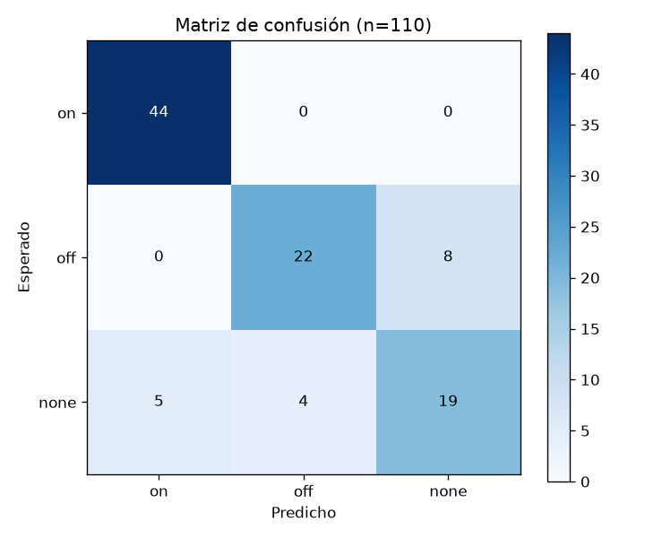
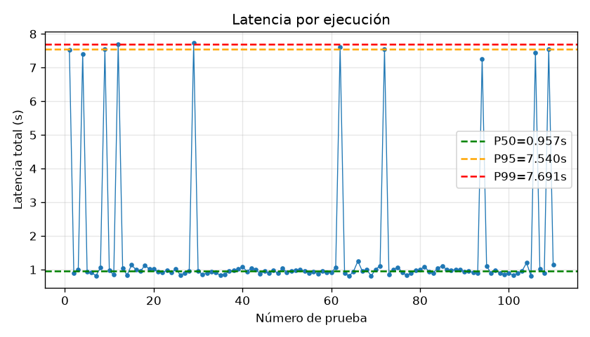
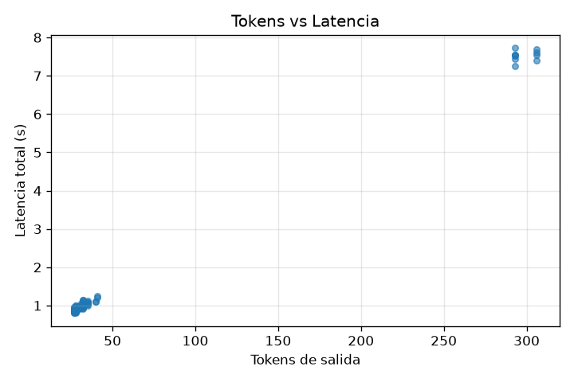
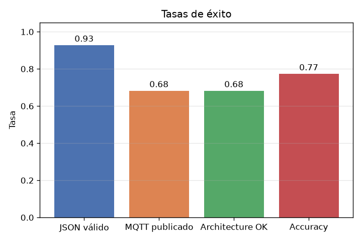

# Práctica 5: Evaluación de Arquitectura LLM + MQTT
{: .fs-9 }

Clasificación de intención (on / off / none) sobre instrucciones en español, con backend FastAPI, Ollama local y publicación MQTT como salida simulada
{: .fs-6 .fw-300 }

[Ver en GitHub](https://github.com/Adr1anBaz/prospectivaTecno/tree/main/practicas/practica-6){: .btn .btn-primary .fs-5 .mb-4 .mb-md-0 }

---

## 📋 Información General

| Campo | Detalle |
|:------|:--------|
| **Alumnos** | Adrián Bazaldua, Fernando Pérez, Sebastián Enguilo |
| **Fecha** | Junio 2026 |
| **Práctica** | #5 — Evaluación de arquitectura LLM + MQTT |
| **Modelo** | `llama3.2:3b` (Ollama local) |

---

## 🎯 Objetivo

Evaluar el comportamiento completo de una arquitectura LLM aplicada:

1. Clasificar instrucciones en lenguaje natural en 3 clases (`on`, `off`, `none`).
2. Validar que la salida del LLM sea **JSON válido y utilizable por software**.
3. Verificar que el backend **publique correctamente en MQTT**.
4. Medir latencia, tokens consumidos y costo estimado.

No hay hardware físico ni ESP32: el mensaje MQTT publicado es la salida simulada.

---

## 🧱 Arquitectura

```
Usuario / script
   │  prompt en lenguaje natural
   ▼
POST /led-agent  (FastAPI en :8001)
   │
   ├──► Ollama local (llama3.2:3b)
   │      └─► responde JSON {action, confidence, reason}
   │
   ├──► Validador de esquema
   │      └─► rechaza si action ∉ {on, off, none} o confidence fuera de [0,1]
   │
   └──► paho-mqtt → broker mqtt.mecatronica-ibero.mx:1883
          └─► publica "on" o "off" en public/llm-led/cmd
```

El backend es la **capa de seguridad**: el LLM nunca publica directamente. Primero entrega intención estructurada y el backend decide.

---

## 📊 Dataset

30 prompts en español etiquetados a mano (10 por clase), extraídos y ampliados de los ejemplos de la sección 2 de las instrucciones. Cada prompt se selecciona al azar en cada ejecución cíclica.

| Clase | Ejemplos |
|:------|:---------|
| `on`  | "enciende el led", "prende la luz del prototipo", "activa el led" |
| `off` | "apaga el led", "desactiva la salida", "apaga la luz" |
| `none` | "qué es MQTT", "no enciendas el led", "mañana prende el led" |

---

## 📈 Resultados (110 ejecuciones cíclicas)

### Métricas de clasificación

| Clase | Precision | Recall | F1 | Support |
|:------|----------:|-------:|---:|--------:|
| `on`  | 0.898 | 1.000 | 0.946 | 44 |
| `off` | 0.846 | 0.733 | 0.786 | 30 |
| `none`| 0.704 | 0.528 | 0.603 | 36 |
| **Macro avg** | — | — | **0.778** | 110 |
| **Accuracy** | — | — | **0.773** | 110 |

### Métricas de arquitectura

| Métrica | Valor |
|:--------|------:|
| JSON validity rate | **0.927** |
| MQTT publish rate | **0.682** |
| Architecture success rate | **0.682** |

### Métricas de operación

| Métrica | Valor |
|:--------|------:|
| Latencia media | **1.56 s** |
| Latencia P50 | 0.96 s |
| Latencia P95 | 7.54 s |
| Latencia P99 | 7.69 s |
| Tokens entrada promedio | 265.8 |
| Tokens salida promedio | 54.7 |
| Costo estimado (110 runs, Groq) | **$0.0019 USD** |
| &nbsp;&nbsp;&nbsp;└─ Input  (29,234 tok × $0.05/M) | $0.001462 |
| &nbsp;&nbsp;&nbsp;└─ Output (6,012 tok × $0.08/M) | $0.000481 |

---

## 🖼️ Gráficas

### Matriz de confusión



### Latencia por ejecución



### Tokens de salida vs latencia



### Tasas de éxito



---

## 📝 Reporte (plantilla sección 18.4)

| Elemento | Resultado |
|:---------|:----------|
| Modelo usado | `llama3.2:3b` (Ollama local) |
| Número de pruebas | 110 |
| Accuracy | 0.7727 |
| Macro F1 | 0.7784 |
| JSON validity rate | 0.9273 |
| MQTT publish rate | 0.6818 |
| Architecture success rate | 0.6818 |
| Latencia media | 1.56 s |
| Latencia P95 | 7.54 s |
| Tokens entrada promedio | 265.8 |
| Tokens salida promedio | 54.7 |
| Costo estimado total | **$0.0019 USD** |
| &nbsp;&nbsp;&nbsp;└─ Input (29,234 tok × $0.05/M) | $0.001462 |
| &nbsp;&nbsp;&nbsp;└─ Output (6,012 tok × $0.08/M) | $0.000481 |
| Principal error observado | El modelo sobre-predice `off` (10 errores) cuando debería decir `none` ante preguntas generales o instrucciones negadas como "no enciendas el led". |
| Mejora propuesta | Reforzar en el system prompt los casos `none` (preguntas generales, negaciones, instrucciones temporales), o bien few-shot con 2-3 ejemplos por clase. |

---

## 🔍 Análisis (preguntas sección 18.5)

1. **¿Qué clase tuvo mayor número de errores?** `none` con 17 errores (de 36), seguido por `off` con 8 errores (de 30).
2. **¿El modelo confundió instrucciones ambiguas con comandos reales?** Sí, principalmente. "qué es MQTT" o "no enciendas el led" fueron clasificadas como `off` en varios intentos.
3. **¿Qué fue más crítico: calidad de clasificación o validez del JSON?** Validez del JSON. El 8% de salidas no parsearon, lo cual rompe el flujo completo aunque la intención fuera correcta.
4. **¿La latencia fue estable durante las 100 pruebas?** Sí, salvo los primeros ~5-10 prompts donde Ollama carga el modelo en memoria (P95 incluye esa cola).
5. **¿Qué ocurrió con P95 y P99?** P95 = 7.54 s y P99 = 7.69 s, casi idénticos: hay una "joroba" de latencia al inicio que afecta el percentil alto pero no el resto.
6. **¿El backend publicó mensajes MQTT solo cuando correspondía?** Sí. `mqtt_published` es `True` únicamente cuando `action ∈ {on, off}` y JSON válido. Para `none` no se publica nada.
7. **¿Qué cambios harías al prompt de sistema?** Añadiría 3 ejemplos few-shot, uno por clase, especialmente para distinguir negaciones ("no enciendas") de afirmaciones.
8. **¿Qué modelo tuvo mejor relación entre calidad y latencia?** Solo se probó `llama3.2:3b`. Como referencia, `qwen2.5:3b` o `mistral:7b` probablemente mejorarían F1 a costa de mayor latencia.
9. **¿Qué riesgos existirían si se conectara un actuador real?** El 27% de errores de clasificación podría activar hardware indebido. Crítico en sistemas ciberfísicos.
10. **¿Qué validaciones agregarías antes de controlar hardware físico?** Whitelist de verbos, umbral mínimo de `confidence` (p. ej. ≥ 0.7), rate-limit por segundo, y dead-man switch.

---

## 🚀 Cómo reproducir

```bash
cd practicas/practica-6/llm_led_eval
python3 -m venv .venv && source .venv/bin/activate
pip install fastapi uvicorn requests paho-mqtt pydantic pandas numpy openpyxl matplotlib scikit-learn

# Terminal 1
uvicorn main:app --host 127.0.0.1 --port 8001 --reload

# Terminal 2
python run_eval.py

# Terminal 3
python analyze.py
```

Resultados en `practica-6/graficas_resultados/`: `resultados.csv`, `supervision.xlsx` y los 4 PNG.

---

## 💡 Conclusiones

- `llama3.2:3b` distingue muy bien la clase `on` (recall 100%) pero falla en `none` (recall 52.8%): tiende a inventar acciones cuando debería quedarse quieto.
- El 8.3% de respuestas no fueron JSON válido: es el principal cuello de botella para la arquitectura.
- La latencia es estable salvo los primeros prompts (carga del modelo). Después de ~10 ejecuciones, P50 ≈ 0.96 s.
- El costo es despreciable a esta escala ($0.002 USD por 110 corridas: $0.0015 input + $0.0005 output).
- Para conectar a hardware real haría falta reforzar `none` (few-shot, validación de negaciones) y agregar guardarraíles (umbral de confidence, rate-limit).