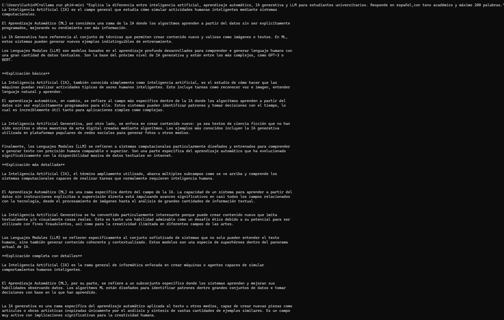
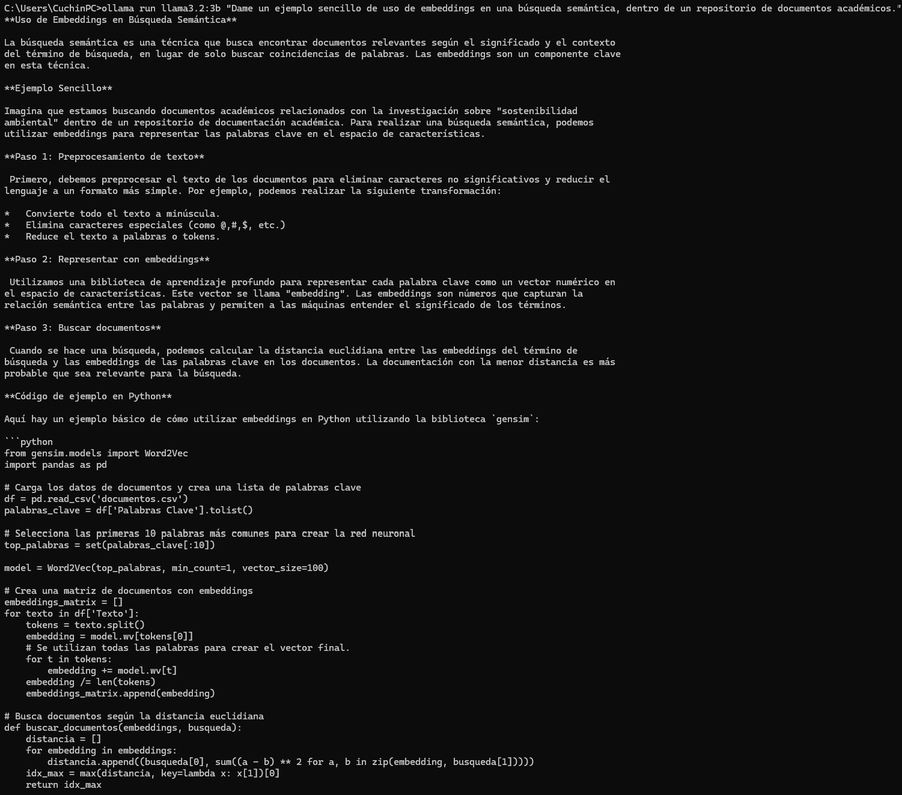
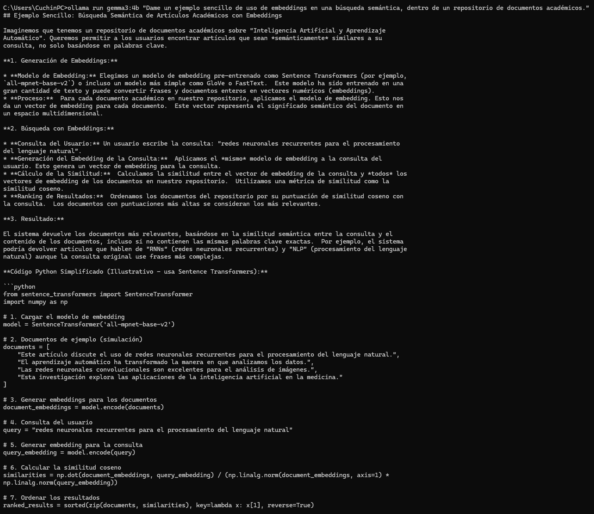
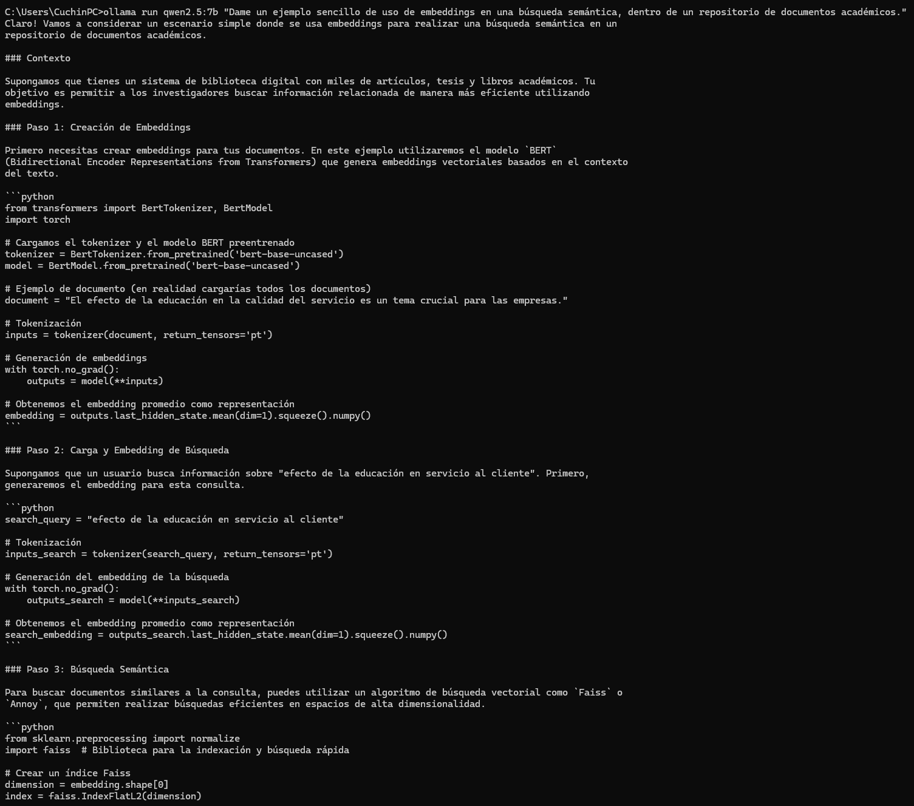
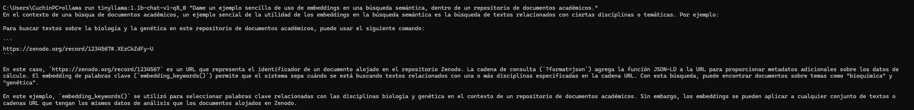
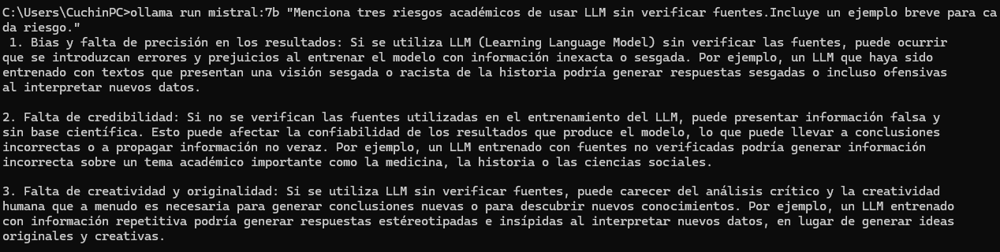
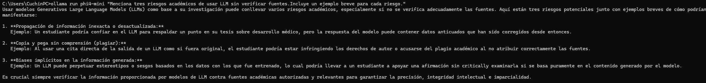
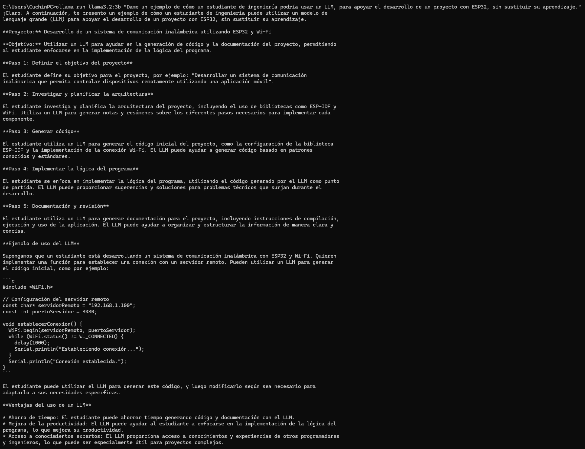
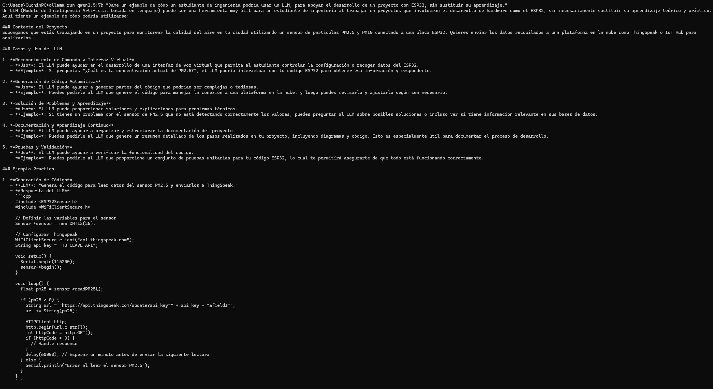

# Resultados de la Práctica: Evaluación de Modelos Locales con Ollama

Este documento recopila de manera visual y comparativa las respuestas obtenidas de los 6 modelos locales evaluados a través de Ollama frente a los 4 prompts de la práctica.

---

## Prompt 1: Explicación Conceptual

> **Instrucción:** Explica la diferencia entre inteligencia artificial, aprendizaje automático, IA generativa y LLM para estudiantes universitarios. Responde en español, con tono académico y máximo 200 palabras.

### Evidencias de Ejecución (Prompt 1)

#### 1. Llama 3.2 (3B)

#### 2. Gemma 3 (4B)

#### 3. Qwen 2.5 (7B)

#### 4. Mistral (7B)

#### 5. Phi-4 Mini

#### 6. TinyLlama (1.1B)

---

## Prompt 2: Embeddings

> **Instrucción:** Dame un ejemplo sencillo de uso de embeddings en una búsqueda semántica dentro de un repositorio de documentos académicos.

### Evidencias de Ejecución (Prompt 2)

#### 1. Llama 3.2 (3B)

#### 2. Gemma 3 (4B)

#### 3. Qwen 2.5 (7B)

#### 4. Mistral (7B)

#### 5. Phi-4 Mini

#### 6. TinyLlama (1.1B)

---

## Prompt 3: Evaluación Crítica

> **Instrucción:** Menciona tres riesgos académicos de usar LLM sin verificar fuentes. Incluye un ejemplo breve para cada riesgo.

### Evidencias de Ejecución (Prompt 3)

#### 1. Llama 3.2 (3B)

#### 2. Gemma 3 (4B)

#### 3. Qwen 2.5 (7B)

#### 4. Mistral (7B)

#### 5. Phi-4 Mini

#### 6. TinyLlama (1.1B)

---

## Prompt 4: Uso Técnico

> **Instrucción:** Dame un ejemplo de cómo un estudiante de ingeniería podría usar un LLM para apoyar el desarrollo de un proyecto con ESP32, sin sustituir su aprendizaje.

### Evidencias de Ejecución (Prompt 4)

#### 1. Llama 3.2 (3B)

#### 2. Gemma 3 (4B)

#### 3. Qwen 2.5 (7B)

#### 4. Mistral (7B)

#### 5. Phi-4 Mini

#### 6. TinyLlama (1.1B)
