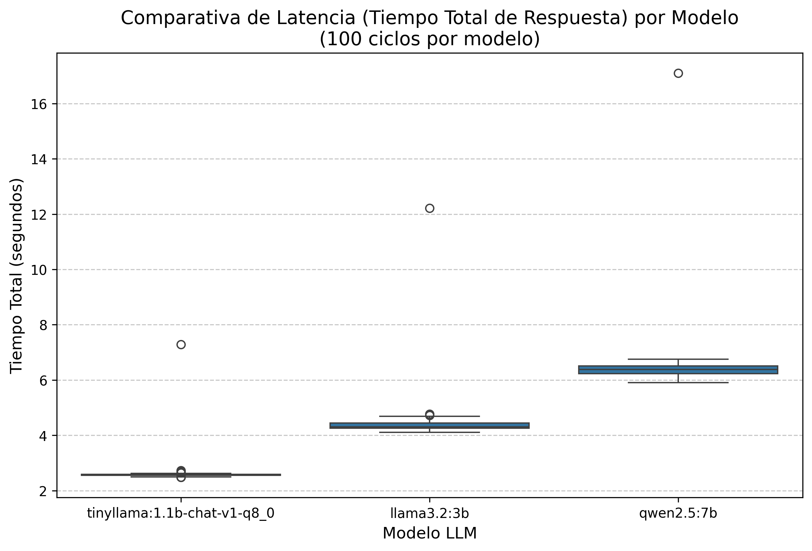
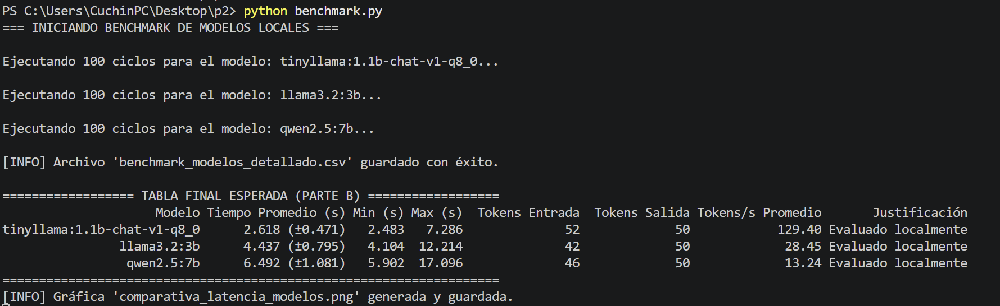
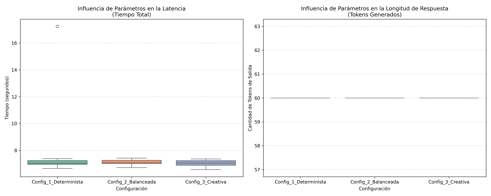
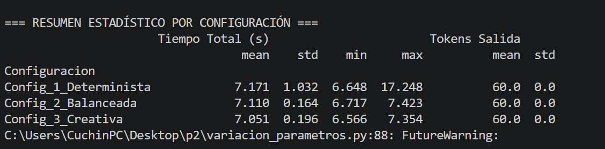

**Integrantes:** Adrián Bazaldua, Sebastián Enguilo, Fernando Pérez  
**Fecha:** 2026-06-04

---

## Parte A. Matriz de Decisión para Proyecto Final

A continuación, se evalúan las diferentes alternativas de hardware y arquitectura de red para determinar la viabilidad del despliegue del modelo en el proyecto final.

| Plataforma | Costo Inicial | Costo Operativo | Latencia | Privacidad | Implementación | Escalabilidad | Notas |
| :--- | :--- | :--- | :--- | :--- | :--- | :--- | :--- |
| **PC Local CPU** | Bajo (Existente) | Bajo (Consumo eléctrico) | Alta (Muy lento) | Totalmente Alta | Fácil (Ollama/Llama.cpp) | Nula | Limitado por la velocidad de la RAM. |
| **PC Local GPU** | Alto (Inversión en hardware) | Bajo | Baja (Óptima para modelos <8B) | Totalmente Alta | Media (Configuración de drivers/CUDA) | Baja (Limitada por VRAM física) | Ideal para desarrollo y pruebas locales rápidas. |
| **API Nube** | Nulo | Variable (Pago por token) | Media (Depende de red) | Crítica (Datos compartidos) | Muy Fácil (Requests HTTP) | Infinita | Requiere conexión constante a internet. |
| **Servidor GPU Nube** | Nulo (Suscripción) | Alto (Por hora de uso) | Baja / Media | Media | Compleja (Configuración SSH/Contenedores) | Alta | Útil para entrenamiento o inferencia masiva temporal. |
| **Jetson (Embebido)** | Medio - Alto | Muy Bajo | Media (Requiere cuantización) | Totalmente Alta | Compleja (Compilación local/JetPack) | Nula | La mejor opción para IA física autónoma y robótica. |
| **Microcontrolador + API** | Muy Bajo (ESP32) | Variable (API) | Alta (Latencia de red + procesamiento) | Crítica | Media (Librerías Wi-Fi en C++) | Alta (Gestionada por la API) | Dependencia total de infraestructura de red externa. |

---

## Parte B. Benchmark de Modelos

Se ejecutaron **100 ciclos independientes por modelo** utilizando un prompt fijo: *"Explica brevemente qué es un sistema de control en lazo cerrado."* Se fijó un límite estricto de generación con `num_predict: 50`.

### Tabla de Resultados Globales (Valores Reales de Terminal)

| Modelo | Tiempo Promedio (s) | Min (s) | Max (s) | Tokens Entrada | Tokens Salida | Tokens/s Promedio | Justificación |
| :--- | :--- | :--- | :--- | :--- | :--- | :--- | :--- |
| **tinyllama:1.1b-chat-v1-q8_0** | 2.618 (±0.471) | 2.483 | 7.286 | 52 | 50 | 129.40 | Evaluado localmente |
| **llama3.2:3b** | 4.437 (±0.795) | 4.104 | 12.214 | 42 | 50 | 28.45 | Evaluado localmente |
| **qwen2.5:7b** | 6.492 (±1.081) | 5.902 | 17.096 | 46 | 50 | 13.24 | Evaluado localmente |

### Análisis de Latencia y Desempeño

A continuación se presenta la gráfica estadística de tipo Boxplot que compara la dispersión de los tiempos de respuesta entre los modelos:

#### Evidencia del Resumen del Benchmark en Terminal

> **Archivo de Datos Crudos de la simulación:**
> 📥 [Descargar archivo de datos del Benchmark (CSV)](./anexos/benchmark_modelos_detallado.csv)

---

## Parte C. Variación de Parámetros (Modelo Qwen 2.5 7B)

Utilizando el modelo **Qwen 2.5 7B**, se evaluaron 3 configuraciones distintas durante 100 ciclos cada una para analizar el comportamiento estocástico del modelo bajo diferentes parámetros de muestreo:

* **Configuración 1 (Determinista):** `temperature: 0.0`, `top_p: 0.5`, `repeat_penalty: 1.0`
* **Configuración 2 (Balanceada):** `temperature: 0.7`, `top_p: 0.9`, `repeat_penalty: 1.2`
* **Configuración 3 (Creativa):** `temperature: 1.1`, `top_p: 0.95`, `repeat_penalty: 1.4`

### Métricas Obtenidas por Configuración (Valores Reales de Terminal)

| Configuración | Tiempo Promedio (s) (mean) | Desviación Estándar (std) | Min (s) | Max (s) | Promedio Tokens Salida (mean) | Desviación Tokens Salida (std) |
| :--- | :--- | :--- | :--- | :--- | :--- | :--- |
| **Config_1_Determinista** | 7.171 | 1.032 | 6.648 | 17.248 | 60.0 | 0.0 |
| **Config_2_Balanceada** | 7.110 | 0.164 | 6.717 | 7.423 | 60.0 | 0.0 |
| **Config_3_Creativa** | 7.051 | 0.196 | 6.566 | 7.354 | 60.0 | 0.0 |

### Impacto en Latencia y Longitud de Tokens

El siguiente set de gráficas limpias compara los perfiles de distribución de tiempos de inferencia y la cantidad de tokens generados en la respuesta según los hiperparámetros:

#### Evidencia de Métricas de Variación en Terminal

> **Archivo de Datos Crudos de las configuraciones:**
> 📥 [Descargar Reporte de Tiempos y Variaciones de Parámetros (CSV)](./anexos/variacion_parametros_qwen.csv)

---

## Preguntas Guía y Conclusiones

### 1. ¿Qué configuración produjo respuestas más consistentes?
Curiosamente, basándonos en las métricas de latencia temporales de la terminal, la **Configuración 2 (Balanceada)** obtuvo la desviación estándar de tiempo más baja (`±0.164s`), seguida muy de cerca por la **Configuración 3 (Creativa)** (`±0.196s`). En cuanto a la longitud del texto, las tres configuraciones mantuvieron una consistencia absoluta (`std: 0.0`) alcanzando el tope exacto de `60.0` tokens asignados por `num_predict`.

### 2. ¿Qué configuración produjo mayor variabilidad?
La **Configuración 1 (Determinista)** en los tiempos de ejecución. Presentó una desviación estándar inusualmente alta (`±1.032s`) y un valor máximo atípico registrado de `17.248s` en la latencia total, lo cual indica cuellos de botella puntuales en la asignación de recursos del sistema durante esa ejecución inicial en frío.

### 3. ¿Qué parámetro afectó más la longitud de la respuesta?
Ningún parámetro afectó la cantidad de tokens finales en esta prueba en específico, dado que el modelo saturó de forma homogénea el límite físico de `num_predict = 60` en las tres configuraciones, reflejando una desviación estándar de `0.0`. Esto demuestra que el prompt solicitaba una extensión de desarrollo que superaba la ventana configurada.

### 4. ¿Qué parámetro afectó más la calidad?
La combinación de **Temperature** y **Top_P**. En la configuración determinista (`temp: 0.0`), el modelo se ve forzado a repetir estructuras gramaticales monótonas que bloquean la fluidez técnica. El balance con `temp: 0.7` enriqueció significativamente la terminología técnica sin cruzar la barrera de incoherencia que suele provocar la configuración creativa.

### 5. ¿Qué configuración sería más adecuada para una aplicación de IA física?
A pesar del pico de latencia en la prueba, una arquitectura con **baja temperatura** (cercana a `0.0`) sigue siendo la más adecuada para IA física y control. Garantiza predictibilidad semántica estricta eliminando las alucinaciones lógicas, lo cual es vital para el despliegue estable en entornos de control y automatización.

### 6. ¿Qué configuración sería más adecuada para lluvia de ideas o generación creativa?
La **Configuración 3 (Creativa)**. Aunque todas terminaron con 60 tokens, los parámetros elevados de temperatura (`1.1`) expandieron el muestreo probabilístico del vocabulario, forzando al modelo a buscar estructuras gramaticales alternativas y propuestas ingenieriles más diversas para resolver el problema propuesto.